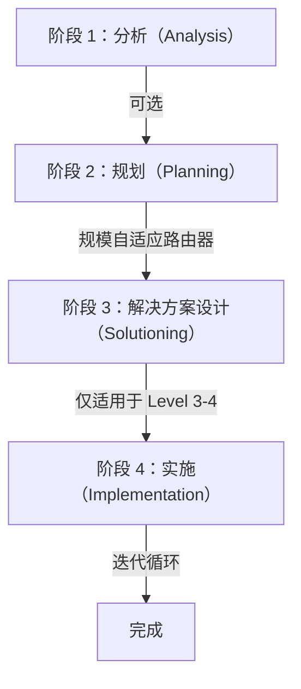
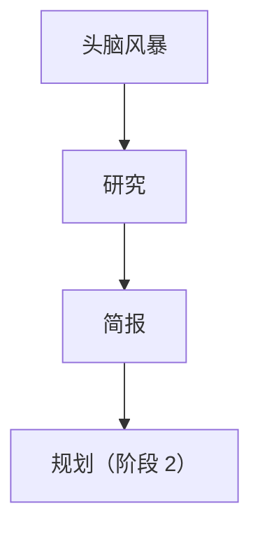
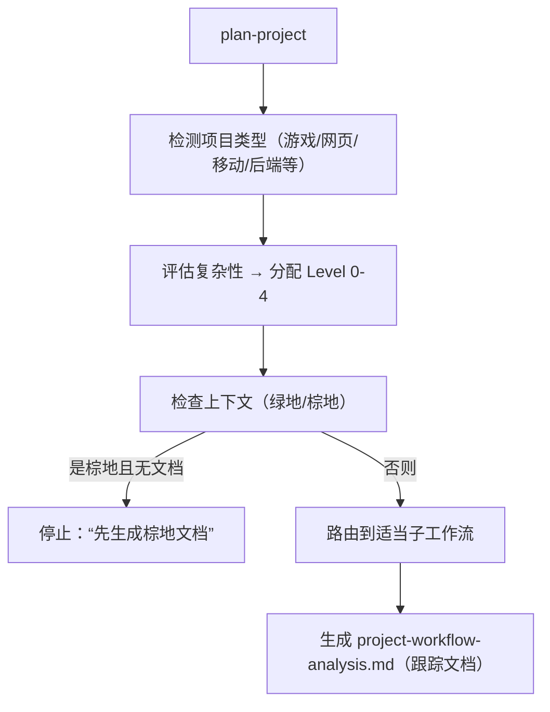
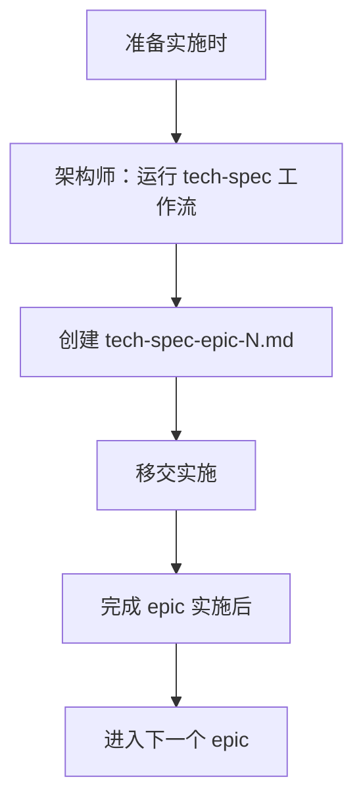
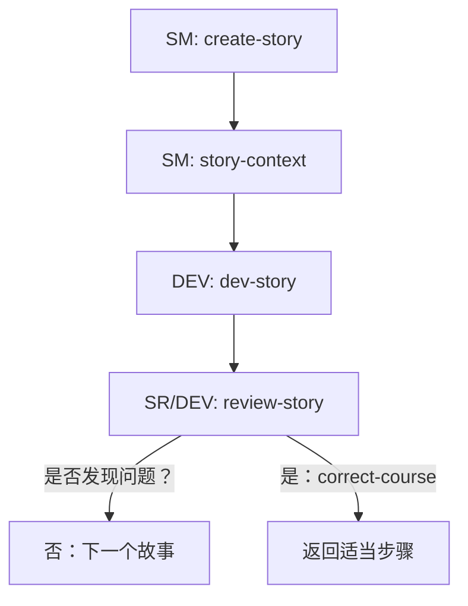
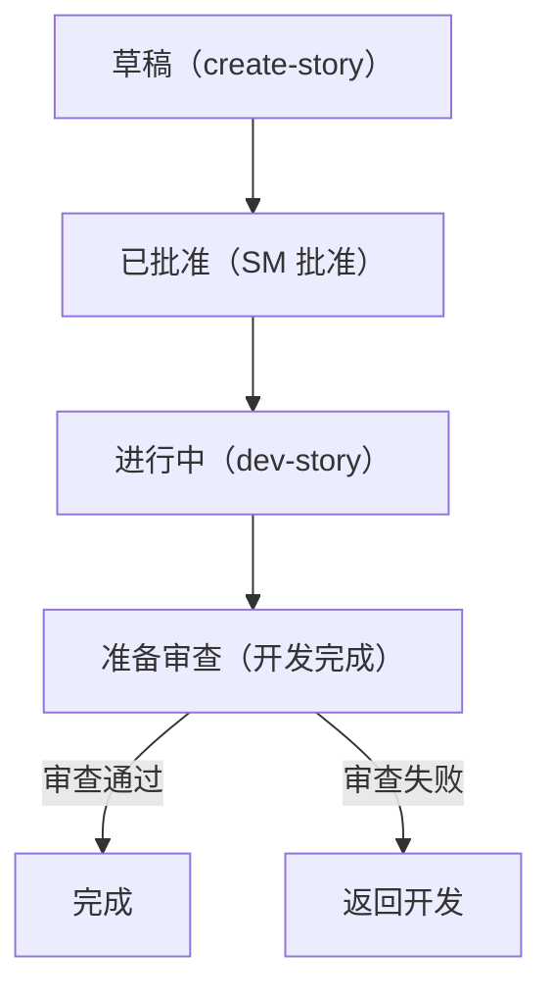
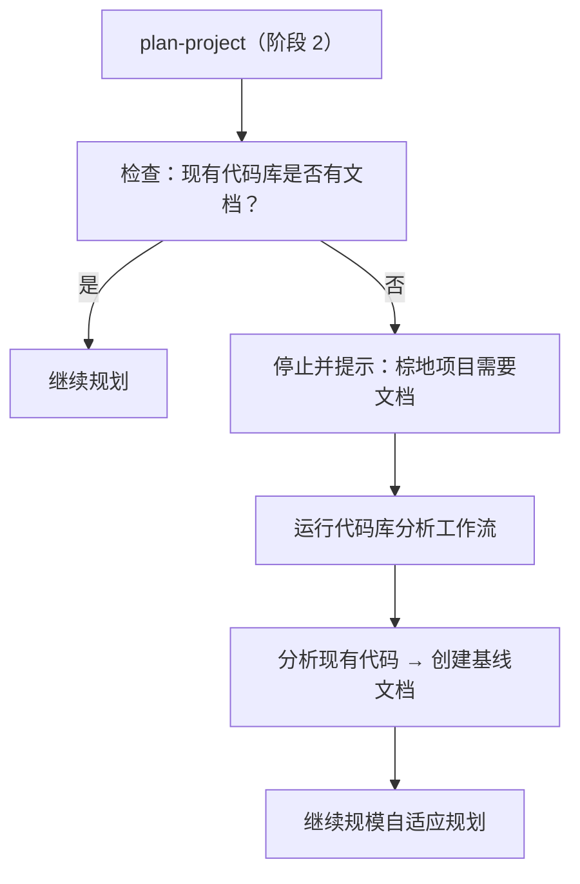

# BMM 工作流 - 完整 v6 流程

BMM（BMAD 方法模块）通过四个不同阶段编排软件开发，每个阶段都有适应项目规模（Level 0-4）和上下文（绿地 vs 棕地）的专用工作流。本文档是理解这些工作流如何互联以交付革命性 v6 方法论的主指南。

## v6 核心创新

**规模自适应规划**：根据复杂性（Level 0-4）自动路由项目，确保文档和流程开销适当。

**即时设计（Just-In-Time Design）**：技术规范在实施过程中按每个 epic 创建，而非一次性完成，随着项目发展融入学习成果。

**动态专业注入**：故事上下文工作流为每个故事提供针对性技术指导，用上下文化专业知识取代静态文档。

**持续学习循环**：回顾将改进反馈到工作流中，使每个 epic 比上一个更顺畅。

## 四个阶段



## 阶段 1：分析（可选）

用于项目发现和需求收集的可选工作流。输出将进入阶段 2 规划。

### 工作流概览

| 工作流                 | 目的                                       | 输出                   | 使用时机             |
| ---------------------- | ------------------------------------------- | ---------------------- | --------------------- |
| **brainstorm-game**    | 使用 5 种方法进行游戏概念创意               | 概念提案               | 新游戏项目           |
| **brainstorm-project** | 软件解决方案探索                           | 架构提案               | 新软件项目           |
| **game-brief**         | 结构化游戏设计基础                         | 游戏简报文档           | 创建 GDD 之前        |
| **product-brief**      | 战略产品规划总结                           | 产品简报               | 分析阶段结束时       |
| **research**           | 多模式研究（市场/技术/深度）               | 研究成果               | 需要证据时           |

### 流程



## 阶段 2：规划（必需）

中央编排器，确定项目规模并生成适当的规划工件。

### 规模级别

| Level | 范围                    | 输出                   | 下一阶段         |
| ----- | ------------------------ | ----------------------- | ---------------- |
| **0** | 单一原子变更            | tech-spec only          | → 实施          |
| **1** | 1-10 个故事，1 个 epic  | Minimal PRD + tech-spec | → 实施          |
| **2** | 5-15 个故事，1-2 个 epic| Focused PRD + tech-spec | → 实施          |
| **3** | 12-40 个故事，2-5 个 epic| Full PRD + Epics list   | → 解决方案设计  |
| **4** | 40+ 个故事，5+ 个 epic  | Enterprise PRD + Epics  | → 解决方案设计  |

### 路由逻辑



### 主要输出

- **PRD.md**：产品需求文档（Level 1-4）
- **Epics.md**：Epic 分解及故事（Level 2-4）
- **tech-spec.md**：技术规范（仅 Level 0-2）
- **GDD.md**：游戏设计文档（游戏项目）
- **project-workflow-analysis.md**：工作流状态跟踪

## 阶段 3：解决方案设计（仅适用于 Level 3-4）

复杂项目的架构和技术设计阶段。

### 工作流职责概览

| 工作流          | 负责人     | 目的                        | 输出                    | 时间点            |
| --------------- | ---------- | --------------------------- | ----------------------- | ----------------- |
| **3-solutioning** | 架构师     | 创建整体架构                | Architecture.md with ADRs | 每项目一次        |
| **tech-spec**   | 架构师     | 创建 epic 特定技术规范      | tech-spec-epic-N.md     | 每个 epic 即时生成 |

### 即时技术规范（Just-In-Time Tech Specs）



**关键**：技术规范按需逐个创建，而非一次性完成。这避免了过度设计，并融入了学习成果。

## 阶段 4：实施（迭代）

将需求转化为可工作的软件的核心开发循环。

### 实施循环



### 工作流职责

| 工作流           | 代理  | 目的                      | 关键创新             |
| ---------------- | ------ | ------------------------- | -------------------- |
| **create-story** | SM     | 一次生成一个故事          | 强制遵循 epics.md 规划 |
| **story-context**| SM     | 创建专业注入              | 即时技术指导         |
| **dev-story**    | DEV    | 结合上下文实施故事        | 可在审查后恢复       |
| **review-story** | SR/DEV | 全面验证故事              | 新鲜上下文审查       |
| **correct-course** | SM    | 处理问题/变更             | 自适应响应           |
| **retrospective** | SM     | 捕获 epic 学习成果        | 持续改进             |

### 故事流状态



## 绿地 vs 棕地项目考量

### 绿地项目

- 从阶段 1（分析）或阶段 2（规划）开始
- 阶段 3 做出干净的架构决策
- 阶段 4 实施简单明了

### 棕地项目



**棕地项目关键**：如果没有现有系统的充分文档，规划阶段无法准确评估范围或创建有意义的需求。棕地分析工作流（即将推出）将：

- 映射现有架构
- 记录当前模式
- 确定集成点
- 评估技术债务
- 创建规划所需的基线

## 各阶段代理参与情况

| 阶段              | 主要代理          | 支持代理               |
| ----------------- | ----------------- | ---------------------- |
| **分析**         | 分析师、研究员    | PM、PO                |
| **规划**         | PM                | 分析师、UX 专家       |
| **解决方案设计** | 架构师            | PM、技术负责人        |
| **实施**         | SM、开发者        | SR、PM（用于 correct-course） |

## 关键文件和工件

### 跟踪文档

- **project-workflow-analysis.md**：维护工作流状态、级别和进度
- **Epics.md**：epic 和故事的主列表（规划的事实来源）

### 阶段输出

- **阶段 1**：简报和研究文档
- **阶段 2**：PRD、Epics 或 tech-spec（根据级别）
- **阶段 3**：Architecture.md、epic 特定技术规范
- **阶段 4**：故事文件、上下文 XML、已实现代码

## 最佳实践

### 1. 尊重规模

- 不要为 Level 0 变更创建 PRD
- 不要跳过 Level 3-4 项目的架构
- 让工作流决定适当的工件

### 2. 拥抱即时性

- 按 epic 一次创建技术规范
- 按需生成故事，而非批量
- 为每个故事构建上下文注入

### 3. 保持流完整性

- 故事必须在 Epics.md 中列出
- 每个阶段完成后再进入下一阶段
- 审查时使用新鲜上下文窗口

### 4. 先记录棕地

- 在理解现有代码之前不要规划
- 技术债务必须在规划中可见
- 集成点需要文档

### 5. 持续学习

- 每个 epic 后运行回顾
- 根据学习更新工作流
- 在团队间共享模式

## 常见陷阱及解决方案

| 陷阱                           | 解决方案                              |
| ----------------------------- | ------------------------------------- |
| 一次性创建所有技术规范        | 使用即时方法 - 按 epic 一次创建       |
| 跳过故事上下文生成            | 在 create-story 后始终运行           |
| 批量创建故事                  | 一次创建一个故事                     |
| 忽略规模级别                  | 让 plan-project 决定级别             |
| 未记录棕地即规划              | 先运行棕地分析                       |
| 未运行回顾                    | 每个 epic 后安排                     |

## 快速参考命令

```bash
# 阶段 1：分析（可选）
bmad analyst brainstorm-project
bmad analyst research
bmad analyst product-brief

# 阶段 2：规划
bmad pm plan-project

# 阶段 3：解决方案设计（L3-4）
bmad architect solution-architecture
bmad architect tech-spec  # 按 epic 即时生成

# 阶段 4：实施
bmad sm create-story      # 一次一个故事
bmad sm story-context     # 每个故事后
bmad dev develop          # 加载上下文实施
bmad dev review-story     # 或 SR 代理
bmad sm correct-course    # 如果有问题
bmad sm retrospective     # 每个 epic 后
```

## 未来增强

### 即将推出

- **棕地分析**：自动代码库文档生成器
- **工作流编排**：自动阶段转换
- **进度仪表盘**：实时工作流状态
- **团队同步**：多开发者故事协调

### 考虑中

- AI 辅助回顾
- 自动故事估算
- 预测性 epic 规划
- 跨项目学习迁移

---

本文档是 BMM v6a 工作流执行的权威指南。有关单个工作流的详细信息，请参阅工作流文件夹中的相应 README 文件。
