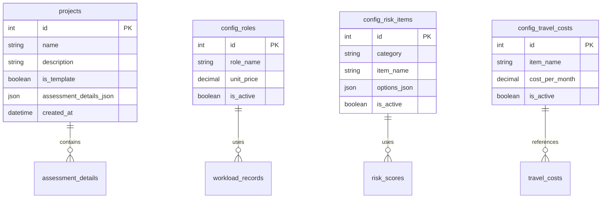
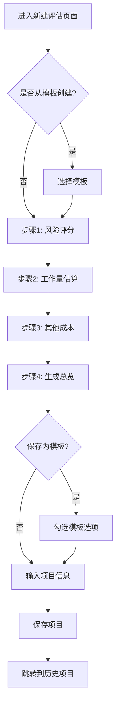
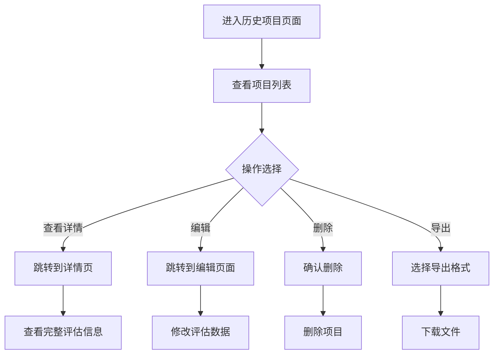

# 软件项目评估系统 - 产品需求文档 (PRD)

**版本**: v2.0  
**最后更新**: 2025-10-21  
**文档状态**: 当前版本

---

## 📋 文档变更记录

| 版本 | 日期 | 变更内容 | 作者 |
|------|------|----------|------|
| v2.0 | 2025-10-21 | 完整重写，基于当前系统实现 | - |
| v1.0 | - | 初始版本 | - |

---

## 1. 产品概述

### 1.1 产品定位

**软件项目评估系统（PPA - Project Portfolio Assessment）** 是一个基于 Web 的项目成本和风险评估管理平台，旨在替代传统的 Excel 表格评估方式，提供系统化、标准化、可追溯的项目评估解决方案。

### 1.2 目标用户

- **主要用户**: 项目经理、售前顾问、技术经理
- **次要用户**: 项目团队成员、管理层决策者

### 1.3 核心价值主张

| 价值点 | 说明 | 具体表现 |
|--------|------|----------|
| **标准化评估** | 统一评估流程和计算模型 | 风险评分体系、角色工时标准 |
| **高效协作** | 模板复用减少重复工作 | 支持将项目保存为模板 |
| **数据驱动** | 实时计算和可视化展示 | Dashboard 数据看板 |
| **历史追溯** | 完整的项目评估历史 | 历史项目查询、编辑、导出 |
| **灵活配置** | 可自定义评估参数 | 角色单价、风险项、差旅成本 |

### 1.4 技术架构

```
┌─────────────────────────────────────────┐
│   前端: React + UMI Max + Ant Design    │
│         端口: 8000                       │
├─────────────────────────────────────────┤
│   后端: Node.js + Express               │
│         端口: 3001                       │
├─────────────────────────────────────────┤
│   数据库: SQLite                        │
│          ppa.db                         │
└─────────────────────────────────────────┘
```

---

## 2. 功能模块概览

系统包含 4 个核心功能模块：

### 2.1 功能架构图

```
PPA 项目评估系统
├── 📊 数据看板 (Dashboard)
│   ├── 统计卡片（项目总数、平均成本）
│   └── 风险分布图
│
├── 📝 项目评估 (Assessment)
│   ├── 新建评估 (向导式流程)
│   │   ├── 步骤1: 风险评分
│   │   ├── 步骤2: 工作量估算
│   │   ├── 步骤3: 其他成本
│   │   └── 步骤4: 生成总览
│   ├── 历史项目 (列表管理)
│   └── 项目详情 (详细展示)
│
├── ⚙️ 参数配置 (Config)
│   ├── 角色与单价管理
│   ├── 风险评估项管理
│   └── 差旅成本管理
│
└── 📄 报告导出
    ├── PDF 报告生成
    └── Excel 数据导出
```

### 2.2 功能清单

| 模块 | 子功能 | 优先级 | 状态 |
|------|--------|--------|------|
| 数据看板 | 统计指标展示 | P0 | ✅ 已实现 |
| 数据看板 | 风险分布图表 | P0 | ✅ 已实现 |
| 项目评估 | 新建评估向导 | P0 | ✅ 已实现 |
| 项目评估 | 历史项目列表 | P0 | ✅ 已实现 |
| 项目评估 | 项目详情查看 | P0 | ✅ 已实现 |
| 项目评估 | 编辑已有项目 | P1 | ✅ 已实现 |
| 项目评估 | 模板功能 | P1 | ✅ 已实现 |
| 参数配置 | 角色管理 | P0 | ✅ 已实现 |
| 参数配置 | 风险项管理 | P0 | ✅ 已实现 |
| 参数配置 | 差旅成本管理 | P0 | ✅ 已实现 |
| 报告导出 | PDF 导出 | P1 | ✅ 已实现 |
| 报告导出 | Excel 导出 | P1 | ✅ 已实现 |

---

## 3. 详细功能规格

详细的功能规格文档已按模块拆分：

### 📚 功能规格文档索引

1. **[数据看板功能规格](./prd/dashboard-spec.md)**
   - 统计卡片设计
   - 图表可视化
   - 数据刷新机制

2. **[项目评估功能规格](./prd/assessment-spec.md)**
   - 新建评估向导流程
   - 风险评分计算逻辑
   - 工作量估算规则
   - 成本计算公式
   - 模板功能设计

3. **[历史项目管理功能规格](./prd/history-spec.md)**
   - 列表展示与筛选
   - 编辑与删除操作
   - 项目详情展示

4. **[参数配置功能规格](./prd/config-spec.md)**
   - 角色与单价管理
   - 风险评估项配置
   - 差旅成本配置

5. **[报告导出功能规格](./prd/export-spec.md)**
   - PDF 报告格式
   - Excel 数据导出

---

## 4. 数据模型

### 4.1 核心数据实体



### 4.2 评估数据结构 (assessment_details_json)

```typescript
interface AssessmentData {
  // 风险评分
  risk_scores: Record<number, number>; // { risk_item_id: selected_score }
  
  // 工作量估算
  development_workload: WorkloadRecord[];  // 新功能开发
  integration_workload: WorkloadRecord[];  // 系统对接
  
  // 其他成本
  travel_months: number;           // 差旅月数
  maintenance_months: number;      // 运维月数
  maintenance_headcount: number;   // 运维人数
  risk_items: RiskCostItem[];      // 风险成本项
  
  // 角色配置快照
  roles: RoleConfig[];
}

interface WorkloadRecord {
  level1_module: string;
  level2_module: string;
  level3_module: string;
  description: string;
  delivery_coefficient: number;
  role_workdays: Record<number, number>; // { role_id: days }
}
```

---

## 5. 用户交互流程

---

## 5. 用户交互流程

### 5.1 新建项目评估流程



### 5.2 查看历史项目流程



---

## 6. 业务规则

### 6.1 风险评分规则

| 规则项 | 说明 |
|--------|------|
| **评分范围** | 每个风险项的分值由配置项决定，通常为 0-10 分 |
| **总分计算** | 风险总分 = ∑(各风险项选中的分值) |
| **评分因子** | 评分因子 = 风险总分 / 100，用于成本计算 |
| **风险等级** | 低风险(<50分)、中风险(50-100分)、高风险(>100分) |

### 6.2 工作量计算规则

```typescript
// 单个模块工时计算
moduleWorkHours = (∑ role_workdays[i]) × delivery_coefficient

// 模块成本计算
moduleCost = ∑(role_workdays[i] × role_unit_price[i] / 20) × delivery_coefficient

// 说明：
// - role_unit_price 单位为"元/人天"
// - 假设每月工作日为 20 天
// - delivery_coefficient 为交付系数，默认 1.0
```

### 6.3 成本计算公式

| 成本项 | 计算公式 |
|--------|----------|
| **软件研发成本** | ∑(新功能开发模块成本) |
| **系统对接成本** | ∑(系统对接模块成本) |
| **差旅成本** | 差旅月数 × 月度差旅成本标准 |
| **运维成本** | 运维月数 × 运维人数 × 平均人力单价 |
| **风险成本** | 用户自定义的风险成本项之和 |
| **报价总计** | 以上所有成本之和 |

---

## 7. 非功能需求

### 7.1 性能要求

| 指标 | 要求 |
|------|------|
| 页面加载时间 | < 2秒 |
| API 响应时间 | < 500ms |
| 并发用户数 | 支持 10 个并发用户 |
| 数据库查询 | < 200ms |

### 7.2 安全性要求

- 数据本地存储（SQLite），无外部数据传输风险
- 输入验证：防止 SQL 注入
- 错误处理：友好的错误提示，不暴露敏感信息

### 7.3 兼容性要求

| 类型 | 要求 |
|------|------|
| 浏览器 | Chrome 90+、Edge 90+、Firefox 88+、Safari 14+ |
| 屏幕分辨率 | 最小 1280×720 |
| Node.js | v14+ |

### 7.4 可维护性要求

- 代码注释覆盖率 > 30%
- 遵循 TypeScript 类型规范
- 组件化开发，可复用性 > 60%

---

## 8. 未来规划

### 8.1 近期规划 (3个月内)

- [ ] 增强数据看板的图表类型（折线图、柱状图）
- [ ] 支持项目对比功能
- [ ] 添加成本趋势分析
- [ ] 优化移动端响应式布局

### 8.2 中期规划 (6个月内)

- [ ] 支持多用户协作
- [ ] 添加权限管理系统
- [ ] 支持自定义报告模板
- [ ] 集成外部数据源（如 Jira、GitLab）

### 8.3 长期规划 (12个月内)

- [ ] AI 辅助评估建议
- [ ] 历史数据机器学习预测
- [ ] 云端部署版本
- [ ] 移动应用开发

---

## 9. 附录

### 9.1 术语表

| 术语 | 全称 | 说明 |
|------|------|------|
| PPA | Project Portfolio Assessment | 项目组合评估 |
| 风险评分 | Risk Assessment Score | 项目风险的量化评分 |
| 交付系数 | Delivery Coefficient | 工作量调整系数，考虑复杂度、不确定性等因素 |
| 人力单价 | Unit Price per Day | 每个角色的日均人力成本 |
| 差旅成本标准 | Travel Cost Standard | 每人每月的差旅费用标准 |

### 9.2 参考文档

- [数据看板功能规格](./prd/dashboard-spec.md)
- [项目评估功能规格](./prd/assessment-spec.md)
- [历史项目管理功能规格](./prd/history-spec.md)
- [参数配置功能规格](./prd/config-spec.md)
- [报告导出功能规格](./prd/export-spec.md)
- [用户手册](./user-manual.md)
- [技术架构文档](../frontend/ppa_frontend/WARP.md)

### 9.3 联系方式

- **项目仓库**: [GitHub - PPA](https://github.com/bruce827/PPA)
- **问题反馈**: 通过 GitHub Issues 提交

---

**文档结束**