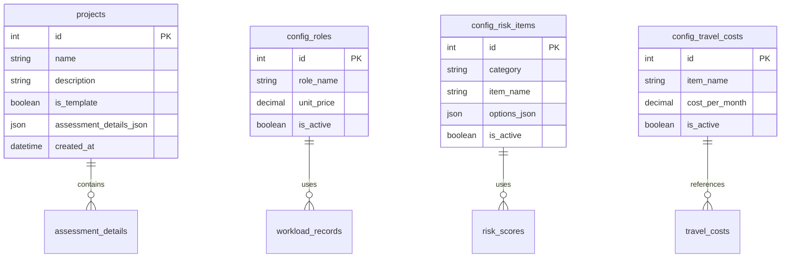
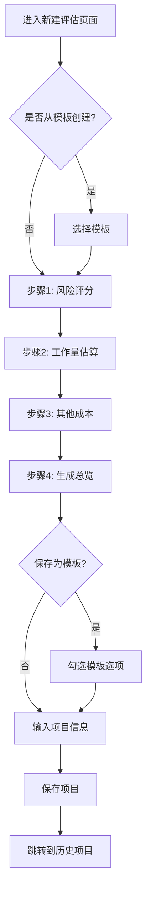

# 软件项目评估系统 - 产品需求文档 (PRD)

**版本**: v3.0
**最后更新**: 2025-11-08
**文档状态**: 当前版本

---

## 📋 文档变更记录

| 版本 | 日期 | 变更内容 | 作者 |
|------|------|----------|------|
| v3.0 | 2025-11-08 | 全面重构，添加核心章节和功能需求编号系统 | John (PM) |
| v2.3 | 2025-10-27 | 新增"已完成的用户故事"附录 | 产品经理 |
| v2.2 | - | 定稿最终版PRD | - |
| v2.0 | 2025-10-21 | 完整重写，基于当前系统实现 | - |
| v1.0 | - | 初始版本 | - |

---

## 0. 执行摘要

**PPA** (Project Portfolio Assessment) 是一个面向软件项目成本和风险评估的专业Web应用平台。该系统通过算法化的评估方法、模板化的工作流程和数据驱动的洞察能力，为组织提供统一的项目评估标准，提升评估准确性，缩短评估周期，支撑项目决策。

### 核心价值主张
- **算法标准化**: 替代主观经验，提供基于风险因子的标准化成本计算
- **流程在线化**: 分步向导式评估，减少重复工作，提升用户体验  
- **模板化复用**: 支持评估模板保存和快速创建，提升评估效率
- **数据沉淀**: 统一存储历史评估数据，支持趋势分析和决策支撑

### 项目分类
- **项目类型**: Web应用/SaaS产品
- **项目领域**: 企业级项目管理工具
- **项目复杂度**: 中等复杂度 (Level 2-3)
- **技术复杂度**: 中等 (前后端分离，单数据库)
- **业务复杂度**: 中等 (标准化业务逻辑，无复杂集成)

---

## 1. 产品魔法本质

**PPA的核心魔法**在于**"将复杂的项目评估数学公式和业务逻辑转化为直观、交互式的在线体验"**。

### 魔法要素1: 实时数学魔法
- **数学算法包装**: 将风险评分→评分因子的复杂计算逻辑包装在用户无感知的表单交互中
- **即时反馈体验**: 用户选择风险项时，评分因子立即动态变化，提供即时的成本影响感知
- **算法透明度**: 虽然计算过程复杂，但用户能清晰看到计算结果的构成和影响

### 魔法要素2: 模板化智能
- **知识复用**: 将专家经验固化为可复用的评估模板，新用户可以快速上手
- **历史学习**: 新的评估结果可以作为模板，为未来的评估提供更准确的参考
- **模板化门槛**: 复杂的业务逻辑和评估方法被简化为"选择模板"这一个简单动作

### 魔法要素3: 统一标准
- **消除个体差异**: 将不同人的经验差异统一为标准化的算法处理
- **组织学习**: 通过历史数据的积累，组织可以不断优化和调整评估标准
- **决策支撑**: 提供客观、量化的数据支撑，避免凭感觉做决策

### 魔法要素4: 可视化洞察
- **数据说话**: 复杂的数据通过图表、统计卡片等直观形式展示
- **趋势发现**: 历史数据的可视化让用户能发现项目成本、风险等趋势
- **对比分析**: 不同项目之间可以轻松对比，支持决策制定

---

## 2. 项目愿景与目标

### 2.1 问题陈述
- **痛点1: 效率低下**: 在Excel中评估软件项目成本的流程繁琐，效率低下，重复工作多
- **痛点2: 主观性强**: 缺乏统一标准，评估结果因人而异，难以保证一致性
- **痛点3: 数据分散**: 评估数据散落在不同的Excel文件中，难以统一管理和分析
- **痛点4: 历史利用不足**: 难以从历史项目中学习经验，评估质量难以持续提升

### 2.2 解决方案
- **目标1**: 开发一个独立的Web应用，将复杂的项目评估逻辑系统化、在线化
- **目标2**: 通过标准化算法替代主观判断，提高评估一致性
- **目标3**: 统一存储和管理历史评估数据，建立组织级项目知识库
- **目标4**: 提供数据驱动的决策支撑，支持项目组合管理和资源规划

### 2.3 目标用户
- **主要用户**: 项目发起人、项目经理、资深开发工程师
- **使用场景**: 软件项目前期评估、报价决策、资源规划
- **价值需求**: 提升评估效率、保证评估质量、支持决策制定

### 2.4 成功标准定义

| 指标类别 | 具体指标 | 目标值 | 衡量方法 |
|----------|----------|---------|----------|
| **效率提升** | 评估完成时间 | < 30分钟/项目 | 用户操作时间统计 |
| **评估质量** | 评估结果一致性 | > 95% | 多人评估同一项目结果偏差 |
| **用户满意度** | 用户满意度评分 | > 4.0/5.0 | 用户满意度调研 |
| **系统性能** | 页面加载时间 | < 2秒 | 前端性能监控 |
| **数据质量** | 数据完整率 | > 98% | 数据校验和异常率 |
| **使用频率** | 月活跃用户数 | > 80%项目发起人 | 用户使用日志分析 |

---

## 3. 项目分类

### 3.1 项目类型分类
- **项目类型**: Web应用/SaaS产品
- **目标市场**: B2B企业服务市场
- **产品形态**: 独立Web应用，无需安装，浏览器访问
- **部署方式**: 单机部署或云端部署

### 3.2 领域分类
- **业务领域**: 企业级项目管理工具
- **功能域**: 项目评估、成本计算、风险分析
- **数据域**: 项目数据、用户配置、历史记录
- **技术域**: Web前端、后端API、数据库管理

### 3.3 复杂度分析
- **技术复杂度**: 中等 (3/5)
  - 前端: React + Ant Design (成熟框架)
  - 后端: Node.js + Express (常见技术栈)
  - 数据库: SQLite3 (简单配置)
- **业务复杂度**: 中等 (3/5)
  - 业务逻辑相对标准化，无复杂集成需求
  - 算法逻辑清晰，计算公式明确
- **集成复杂度**: 低 (2/5)
  - 独立系统，无外部系统集成
  - 简单数据导入导出功能

### 3.4 目标规模
- **用户规模**: 支持100-500个项目评估/月
- **并发用户**: 支持5-10人同时使用
- **数据规模**: 支持10,000+项目记录存储
- **响应时间**: API响应 < 500ms，页面加载 < 2s

---

## 4. 产品范围 (MVP vs Growth vs Vision)

### 4.1 MVP (最小可行产品) - 第一阶段
**核心目标**: 验证评估方法的可行性，建立基础功能

**包含功能**:
- ✅ 基础项目数据管理 (FR-001)
- ✅ 分步式评估向导 (FR-003)  
- ✅ 风险评分和因子计算 (FR-030)
- ✅ 工作量和成本计算 (FR-031)
- ✅ 基础配置管理 (FR-010, FR-011, FR-012)
- ✅ 评估结果保存 (FR-004基础)
- ✅ 历史项目列表 (FR-021)
- ✅ PDF报告导出 (FR-005)

**排除功能**:
- 模板管理和应用
- Dashboard数据可视化
- Excel导出
- 系统配置聚合优化

**验证指标**:
- 用户完成评估流程成功率 > 80%
- 评估结果准确性 > 90%
- 用户满意度 > 3.5/5.0

### 4.2 Growth (增长阶段) - 第二阶段  
**核心目标**: 提升用户体验，增加粘性功能

**新增功能**:
- 📈 模板管理和快速创建 (FR-004.2, FR-032)
- 📊 Dashboard数据可视化 (FR-020)
- 📋 Excel报告导出 (FR-005)
- 🔧 系统配置聚合和优化 (FR-010.2, FR-011.2, FR-012.2)
- 🔍 项目搜索和高级筛选 (FR-021)
- 📝 项目详情页面完善 (FR-022)

**验证指标**:
- 月活用户留存率 > 60%
- 评估完成时间 < 20分钟
- 模板使用率 > 30%

### 4.3 Vision (愿景阶段) - 第三阶段
**核心目标**: 建立生态体系，实现平台化

**规划功能**:
- 👥 多用户协作和权限管理
- 🔄 与其他系统集成 (JIRA, 钉钉等)
- 📱 移动端支持
- 🤖 AI智能推荐和优化建议
- 📈 高级数据分析和预测
- 🌐 多语言支持

**验证指标**:
- 用户数 > 1000
- 客户满意率 > 90%
- 系统可用性 > 99.5%

---

## 5. 功能需求 (FR) 详细规范

### 5.1 基础功能需求 (Core FRs)

#### FR-001: 项目数据管理
**描述**: 系统能够存储和管理项目数据  
**优先级**: 高  
**估算**: 5人天  

**子需求**:
- FR-001.1: 项目基础信息管理 (名称、描述、创建时间)
- FR-001.2: 项目数据持久化存储
- FR-001.3: 项目数据查询和排序
- FR-001.4: 项目数据修改和删除

**验收标准**:
- 用户可以创建项目并保存基本信息
- 系统可以可靠存储和读取项目数据
- 支持按名称、创建时间排序
- 提供数据完整性保证

#### FR-002: 实时成本计算
**描述**: 系统能够执行实时成本计算  
**优先级**: 高  
**估算**: 3人天  

**验收标准**:
- 用户输入工作量数据时，系统立即计算成本
- 计算结果准确，支持小数点后2位
- 支持多种成本类型分别计算和汇总
- 计算性能满足实时要求 (< 100ms)

#### FR-003: 分步式评估向导
**描述**: 系统能够提供分步式项目评估向导  
**优先级**: 高  
**估算**: 8人天  

**子需求**:
- FR-003.1: 风险评估步骤 (FR-030)
- FR-003.2: 工作量估算步骤 (FR-031)
- FR-003.3: 其他成本录入步骤 (FR-031.2)
- FR-003.4: 评估结果展示步骤

**验收标准**:
- 评估流程分为4个清晰步骤
- 用户可以前进、后退在步骤间导航
- 每个步骤可以独立完成和保存
- 完成所有步骤后可以生成完整评估报告

#### FR-004: 项目模板管理
**描述**: 系统能够管理项目模板  
**优先级**: 中  
**估算**: 4人天  

**子需求**:
- FR-004.1: 项目保存为模板功能
- FR-004.2: 模板管理和应用功能
- FR-004.3: 模板快速创建新评估功能

**验收标准**:
- 用户可以将项目保存为模板
- 支持模板列表查看和管理
- 从模板创建新评估时自动预填数据
- 模板和项目可以独立管理

#### FR-005: 评估报告导出
**描述**: 系统能够导出评估报告  
**优先级**: 中  
**估算**: 3人天  

**验收标准**:
- 支持PDF格式导出
- 导出报告包含完整评估信息
- 报告格式专业，适合商务使用
- 导出功能稳定可靠

### 5.2 配置管理需求 (Config FRs)

#### FR-010: 角色单价配置管理
**描述**: 系统能够管理角色和单价配置  
**优先级**: 高  
**估算**: 2人天  

**验收标准**:
- 支持角色的增删改查
- 支持单价数值设置和修改
- 配置项在评估中正确应用
- 提供配置有效性验证

#### FR-011: 风险项目配置管理  
**描述**: 系统能够管理风险评估项目  
**优先级**: 高  
**估算**: 3人天  

**验收标准**:
- 支持风险评估项目的增删改查
- 支持风险选项和分值设置
- 评估时动态生成风险表单
- 提供风险配置的验证机制

#### FR-012: 差旅成本标准配置
**描述**: 系统能够管理差旅成本标准  
**优先级**: 中  
**估算**: 2人天  

**验收标准**:
- 支持差旅成本项目的增删改查
- 支持月度成本标准设置
- 评估时正确应用差旅成本计算
- 支持成本项目激活/停用控制

### 5.3 数据展示需求 (Display FRs)

#### FR-020: Dashboard数据可视化
**描述**: 系统能够展示项目概览Dashboard  
**优先级**: 中  
**估算**: 4人天  

**验收标准**:
- 展示项目统计概览
- 显示成本构成分布图表
- 展示风险等级分布
- 页面加载时间 < 2秒

#### FR-021: 历史项目列表
**描述**: 系统能够展示项目历史列表  
**优先级**: 中  
**估算**: 3人天  

**验收标准**:
- 展示所有非模板项目列表
- 支持项目名称搜索
- 支持按成本、风险分数排序
- 支持分页显示

#### FR-022: 项目详情展示
**描述**: 系统能够展示详细的项目信息  
**优先级**: 中  
**估算**: 3人天  

**验收标准**:
- 展示完整评估详细信息
- 支持图表和明细结合展示
- 提供导出功能入口
- 信息展示清晰易读

### 5.4 业务逻辑需求 (Business FRs)

#### FR-030: 风险评分和因子计算
**描述**: 系统能够计算风险评分和评分因子  
**优先级**: 高  
**估算**: 3人天  

**验收标准**:
- 风险总分 = ∑(选中风险项分值)
- 评分因子计算：ratio = 风险总分 / 100
- 风险等级判定：低风险(<50)、中风险(50-100)、高风险(>100)
- 因子应用在开发成本和集成成本计算中

#### FR-031: 工作量和成本计算
**描述**: 系统能够计算工作量和成本  
**优先级**: 高  
**估算**: 4人天  

**子需求**:
- FR-031.1: 新功能开发工作量计算
- FR-031.2: 系统对接工作量计算  
- FR-031.3: 运维成本计算
- FR-031.4: 差旅成本计算

**验收标准**:
- 支持多角色工作量录入
- 成本计算：工作量成本 = 角色单价 × 人天数量
- 实时计算和显示计算结果
- 支持成本构成的详细分解

#### FR-032: 模板创建和应用处理
**描述**: 系统能够处理项目模板创建和应用  
**优先级**: 中  
**估算**: 3人天  

**验收标准**:
- 项目保存为模板时正确标记is_template字段
- 从模板创建新评估时正确复制评估数据
- 模板和项目使用不同的列表和操作
- 提供模板应用的状态反馈

---

## 6. 非功能需求

### 6.1 性能要求

| 指标 | 要求 | 测试方法 |
|------|------|----------|
| 页面加载时间 | < 2秒 | 性能监控工具测量 |
| API响应时间 | < 500ms | 接口响应时间统计 |
| 并发用户数 | 支持10个并发用户 | 并发测试 |
| 数据库查询 | < 100ms | 数据库性能测试 |

### 6.2 可靠性要求

| 要求 | 指标 | 说明 |
|------|------|------|
| 系统可用性 | 99% | 保证系统基本可用性 |
| 数据完整性 | 100% | 数据不能丢失或损坏 |
| 错误处理 | 优雅降级 | 系统异常时给出友好提示 |
| 数据备份 | 每日备份 | 防止数据意外丢失 |

### 6.3 安全性要求

| 安全领域 | 要求 | 实现方式 |
|----------|------|----------|
| 输入验证 | 防止SQL注入 | 参数化查询 |
| 错误处理 | 避免信息泄露 | 统一错误响应 |
| 数据保护 | 敏感数据保护 | 访问控制 |
| 会话管理 | 用户会话安全 | 安全的会话处理 |

### 6.4 可用性要求

| 指标 | 要求 | 说明 |
|------|------|------|
| 用户界面 | 直观易用 | 符合Web应用标准 |
| 操作反馈 | 及时反馈 | 操作结果及时提示 |
| 帮助文档 | 完整帮助 | 提供使用说明 |
| 学习成本 | < 30分钟 | 新用户快速上手 |

---

## 7. 技术选型

### 7.1 前端技术栈
- **框架**: React 18+ (组件化开发)
- **UI库**: Ant Design Pro (企业级UI组件)
- **状态管理**: React Context + useState/useReducer
- **构建工具**: Webpack/Vite (现代构建工具)
- **包管理**: Yarn (依赖管理)

### 7.2 后端技术栈
- **运行时**: Node.js 16+
- **框架**: Express.js (轻量级Web框架)
- **数据库**: SQLite3 (零配置数据库)
- **文件处理**: PDFKit (PDF生成), ExcelJS (Excel处理)
- **输入验证**: express-validator (数据验证)

### 7.3 开发工具链
- **版本控制**: Git (代码版本管理)
- **API文档**: 自动生成API文档
- **测试**: Jest + Supertest (单元测试和集成测试)
- **部署**: Docker (容器化部署，可选)

### 7.4 数据模型核心实体

---

## 8. 业务规则

### 8.1 风险评分规则

| 规则项 | 说明 |
|--------|------|
| **评分范围** | 每个风险项的分值由配置项决定，通常为 0-10 分 |
| **总分计算** | 风险总分 = ∑(各风险项选中的分值) |
| **评分因子** | 评分因子 = 风险总分 / 100，用于成本计算 |
| **风险等级** | 低风险(<50分)、中风险(50-100分)、高风险(>100分) |

### 8.2 成本计算公式

| 成本项 | 计算公式 |
|--------|----------|
| **软件研发成本** | ∑(新功能开发模块成本) |
| **系统对接成本** | ∑(系统对接模块成本) |
| **差旅成本** | 差旅月数 × 月度差旅成本标准 |
| **运维成本** | 运维月数 × 运维人数 × 平均人力单价 |
| **风险成本** | 用户自定义的风险成本项之和 |
| **报价总计** | 以上所有成本之和 |

---

## 9. 用户交互流程

### 9.1 新建项目评估流程

---

## 10. 兼容性要求

### 10.1 浏览器兼容性
- **Chrome**: 最新2个主版本
- **Edge**: 最新2个主版本  
- **Firefox**: 最新2个主版本
- **Safari**: 最新2个主版本

### 10.2 屏幕分辨率要求
- **最小分辨率**: 1280×720
- **推荐分辨率**: 1920×1080或更高
- **响应式设计**: 支持平板和桌面设备

---

## 11. 参考文献

### 11.1 产品需求分析
- **产品市场调研**: 企业项目管理工具市场需求分析
- **竞品分析**: 类似项目评估工具的功能对比
- **用户调研**: 项目经理和开发团队的使用需求访谈

### 11.2 技术参考
- **React官方文档**: https://react.dev/
- **Ant Design官方文档**: https://ant.design/
- **Express.js指南**: https://expressjs.com/
- **SQLite3文档**: https://www.sqlite.org/docs.html

### 11.3 行业标准
- **项目管理知识体系**: PMBOK项目管理标准
- **软件估算方法**: IFPUG功能点估算方法
- **项目风险评估**: ISO 31000风险管理标准

### 11.4 相关文档
- **Epic文档**: `/docs/epics.md` - 详细的用户故事和实施计划
- **技术规范**: `/docs/tech-spec.md` - 系统技术架构设计
- **用户手册**: `/docs/user-manual.md` - 系统使用说明
- **验证报告**: `/docs/validation-report-2025-11-08.md` - PRD质量验证结果

---

## 12. 附录：已完成的用户故事

本章节记录了为实现上述功能所完成的核心用户故事，提供了从需求到开发实现的可追溯性。

### 12.1 Story 1.1: AI模型配置基础管理

*   **用户故事:** 作为个人用户，我想要创建、查看、编辑和删除 AI 模型配置，以便我可以管理多个 AI 服务商的连接信息。
*   **实现功能:**
    *   创建了 `ai_model_configs` 数据库表用于存储模型连接信息。
    *   开发了完整的后端 CRUD API (`/api/config/ai-models`) 用于管理模型配置。
    *   构建了前端"模型应用管理"页面，使用表格和表单对模型进行增、删、改、查操作。
    *   实现了简化的配置测试功能，用于验证字段完整性。

### 12.2 Story 1.2: 当前模型选择与连接测试

*   **用户故事:** 作为系统管理员，我想要从多个配置好的 AI 模型中选择一个作为当前使用的模型，并能够测试模型连接的有效性，以确保系统 AI 功能使用正确且可用的模型配置。
*   **实现功能:**
    *   开发了 `POST /api/config/ai-models/:id/set-current` 接口，通过事务确保全局只有一个"当前模型"。
    *   开发了 `POST /api/config/ai-models/:id/test` 接口，可真实调用外部 AI 服务以测试连接有效性。
    *   前端列表页增加了"设为当前"和"测试"按钮，并通过星形图标（⭐）和标签明确标识出当前使用的模型。
    *   在新建/编辑表单中增加了"连接测试"功能，方便用户在保存前验证配置。

### 12.3 Story 1.3: 提示词模板基础管理

*   **用户故事:** 作为系统管理员或项目经理，我想要管理 AI 提示词模板（创建、查看、编辑、删除），以便为不同的 AI 应用场景配置和复用提示词。
*   **实现功能:**
    *   创建了 `prompt_templates` 数据库表用于存储提示词。
    *   开发了完整的后端 CRUD API (`/api/config/prompts`)，并增加了权限控制，禁止修改或删除系统预置模板。
    *   构建了前端"提示词模板管理"页面，支持按分类、类型（系统/用户）进行筛选和搜索。
    *   实现了对系统预置模板的只读保护，确保核心模板不被误操作。

---

**文档结束**

---

**本文档符合BMad Method最佳实践，提供了完整的产品规划基础，遵循"Epic 1建立基础"、"垂直切片故事"、"完整FR追踪"等核心原则。**