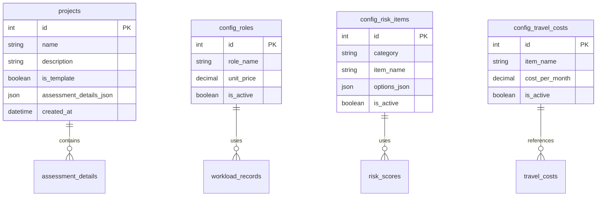
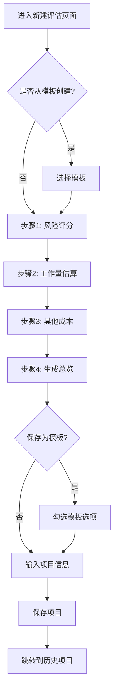

# 软件项目评估系统 - 产品需求文档 (PRD)

**版本**: v2.3
**最后更新**: 2025-10-27
**文档状态**: 当前版本

---

## 📋 文档变更记录

| 版本 | 日期 | 变更内容 | 作者 |
|------|------|----------|------|
| v2.3 | 2025-10-27 | 新增“已完成的用户故事”附录 | 产品经理 |
| v2.2 | - | 定稿最终版PRD | - |
| v2.0 | 2025-10-21 | 完整重写，基于当前系统实现 | - |
| v1.0 | - | 初始版本 | - |

---

## 1. 项目愿景与目标

*   **问题陈述：** 在Excel中评估软件项目成本的流程繁琐、效率低下，且难以对历史数据进行统一管理和分析。
*   **项目目标：** 开发一个独立的Web应用，将复杂的项目评估逻辑系统化、在线化，以提高评估效率、规范评估流程，并沉淀历史数据。
*   **目标用户：** 项目发起人及有相似评估需求的同事。

---

## 2. 核心功能 (已全部实现)

*   **数据看板 (Dashboard):**
    *   在应用首页，通过统计卡片和图表，直观展示所有已评估项目的核心指标，如：项目总数、平均成本、风险等级分布等。

*   **项目评估模块 (核心):**
    *   提供一个分步骤的向导式界面，引导用户完成一次完整的项目评估。
    *   **模板化创建:** 支持从空白创建，或从一个已有的“模板”快速创建新评估，自动填充所有数据。
    *   **步骤1: 风险评分:** 动态生成风险评估问卷，用户完成选择后，实时计算并显示风险总分和`评分因子`。
    *   **步骤2: 工作量估算:** 在可动态增删的表格中，录入“新功能开发”和“系统对接”的详细人天，系统实时计算`工时`。
    *   **步骤3: 其他成本:** 在表单中录入`差旅`、`运维`和`风险`等支持性成本。
    *   **步骤4: 生成总览与保存:**
        *   提供“计算最新报价”功能，实时预览结构化的成本总览。
        *   支持将评估结果保存为一个新的“项目”，或勾选“另存为模板”以供未来复用。

*   **历史项目列表:**
    *   集中展示所有已保存的评估项目（非模板）。
    *   提供基于项目名称的搜索和基于各列的排序功能。
    *   支持对项目进行 **查看详情**、**编辑** 和 **删除** 操作。

*   **报告导出:**
    *   在项目详情页，支持将评估报告 **导出为PDF** (用于正式交付) 或 **导出为Excel** (用于数据分析)。

*   **参数配置中心:**
    *   **角色与单价管理：** 允许用户自定义评估模型中使用的角色及其人力成本单价。
    *   **成本标准管理：** 允许用户自定义差旅成本的计算标准。
    *   **评估模板管理：** 允许用户自定义风险评估问卷中的计分项和选项。

---

## 3. 技术选型

*   **前端:** Ant Design Pro (基于 React)
*   **后端:** Node.js + Express
*   **数据库:** SQLite3

---

## 4. 数据模型

### 4.1 核心数据实体

---

## 5. 用户交互流程

### 5.1 新建项目评估流程

---

## 6. 业务规则

### 6.1 风险评分规则

| 规则项 | 说明 |
|--------|------|
| **评分范围** | 每个风险项的分值由配置项决定，通常为 0-10 分 |
| **总分计算** | 风险总分 = ∑(各风险项选中的分值) |
| **评分因子** | 评分因子 = 风险总分 / 100，用于成本计算 |
| **风险等级** | 低风险(<50分)、中风险(50-100分)、高风险(>100分) |

### 6.2 成本计算公式

| 成本项 | 计算公式 |
|--------|----------|
| **软件研发成本** | ∑(新功能开发模块成本) |
| **系统对接成本** | ∑(系统对接模块成本) |
| **差旅成本** | 差旅月数 × 月度差旅成本标准 |
| **运维成本** | 运维月数 × 运维人数 × 平均人力单价 |
| **风险成本** | 用户自定义的风险成本项之和 |
| **报价总计** | 以上所有成本之和 |

---

## 7. 非功能需求

### 7.1 性能要求

| 指标 | 要求 |
|------|------|
| 页面加载时间 | < 2秒 |
| API 响应时间 | < 500ms |
| 并发用户数 | 支持 10 个并发用户 |

### 7.2 安全性要求

- 输入验证：防止 SQL 注入等常见漏洞。
- 错误处理：返回友好的错误提示，避免暴露敏感信息。

### 7.3 兼容性要求

| 类型 | 要求 |
|------|------|
| 浏览器 | Chrome, Edge, Firefox, Safari 的最新两个主版本 |
| 屏幕分辨率 | 最小 1280×720 |

---

## 8. 未来规划

### 8.1 近期规划 (3个月内)

- [ ] 增强数据看板的图表类型（折线图、柱状图）
- [ ] 支持项目对比功能
- [ ] 添加成本趋势分析

### 8.2 中期规划 (6个月内)

- [ ] 支持多用户协作与权限管理
- [ ] 支持自定义报告模板

---

## 9. 附录

### 9.1 术语表

| 术语 | 全称 | 说明 |
|------|------|------|
| PPA | Project Portfolio Assessment | 项目组合评估 |
| 评分因子 | Risk Factor | 由风险总分换算得出的成本调整系数 |
| 交付系数 | Delivery Coefficient | 工作量调整系数，考虑复杂度、不确定性等因素 |

---

## 10. 附录：已完成的用户故事

本章节记录了为实现上述功能所完成的核心用户故事，提供了从需求到开发实现的可追溯性。

### 10.1 Story 1.1: AI模型配置基础管理

*   **用户故事:** 作为个人用户，我想要创建、查看、编辑和删除 AI 模型配置，以便我可以管理多个 AI 服务商的连接信息。
*   **实现功能:**
    *   创建了 `ai_model_configs` 数据库表用于存储模型连接信息。
    *   开发了完整的后端 CRUD API (`/api/config/ai-models`) 用于管理模型配置。
    *   构建了前端“模型应用管理”页面，使用表格和表单对模型进行增、删、改、查操作。
    *   实现了简化的配置测试功能，用于验证字段完整性。

### 10.2 Story 1.2: 当前模型选择与连接测试

*   **用户故事:** 作为系统管理员，我想要从多个配置好的 AI 模型中选择一个作为当前使用的模型，并能够测试模型连接的有效性，以确保系统 AI 功能使用正确且可用的模型配置。
*   **实现功能:**
    *   开发了 `POST /api/config/ai-models/:id/set-current` 接口，通过事务确保全局只有一个“当前模型”。
    *   开发了 `POST /api/config/ai-models/:id/test` 接口，可真实调用外部 AI 服务以测试连接有效性。
    *   前端列表页增加了“设为当前”和“测试”按钮，并通过星形图标（⭐）和标签明确标识出当前使用的模型。
    *   在新建/编辑表单中增加了“连接测试”功能，方便用户在保存前验证配置。

### 10.3 Story 1.3: 提示词模板基础管理

*   **用户故事:** 作为系统管理员或项目经理，我想要管理 AI 提示词模板（创建、查看、编辑、删除），以便为不同的 AI 应用场景配置和复用提示词。
*   **实现功能:**
    *   创建了 `prompt_templates` 数据库表用于存储提示词。
    *   开发了完整的后端 CRUD API (`/api/config/prompts`)，并增加了权限控制，禁止修改或删除系统预置模板。
    *   构建了前端“提示词模板管理”页面，支持按分类、类型（系统/用户）进行筛选和搜索。
    *   实现了对系统预置模板的只读保护，确保核心模板不被误操作。

---

**文档结束**