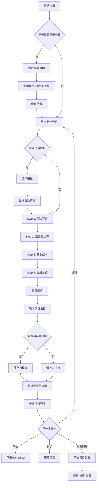

# 项目评估系统 - 自动化测试PRD

**文档版本**: v1.0  
**创建日期**: 2025-10-20  
**目标**: 为自动化测试脚本生成提供详尽的功能规格说明

---

## 1. 系统概述

### 1.1 技术架构
- **前端**: UMI Max (React) + Ant Design + TypeScript (端口: 8000)
- **后端**: Node.js + Express (端口: 3001)
- **数据库**: SQLite3 (ppa.db)
- **代理配置**: 前端 `/api` → `http://localhost:3001`

### 1.2 核心业务流程
```
参数配置 → 选择模板(可选) → 风险评分 → 工作量估算 → 其他成本 → 生成报价 → 保存项目 → 查看/导出
```

---

## 2. 功能模块详细规格

### 2.1 数据看板模块 (`/dashboard`)

#### 2.1.1 页面元素
| 元素名称 | 类型 | 数据源 | 计算逻辑 |
|---------|------|--------|---------|
| 评估项目总数 | Statistic | `/api/projects` | 返回数组长度 |
| 项目平均成本 | Statistic | `/api/projects` | `sum(final_total_cost) / count` |
| 风险等级分布图 | PieChart | `/api/projects` | 根据 `final_risk_score` 分组统计 |

#### 2.1.2 风险等级分类规则
```javascript
if (final_risk_score < 50) return '低风险';
else if (final_risk_score <= 100) return '中风险';
else return '高风险';
```

#### 2.1.3 API 依赖
- **GET** `/api/projects` 
  - 响应格式: `{ data: Array<{ id, name, final_total_cost, final_risk_score, created_at }> }`

#### 2.1.4 测试场景
1. **空数据场景**: 无项目时，统计卡片显示 0
2. **正常数据场景**: 有项目时，正确显示统计数据
3. **数据刷新**: 新增项目后，看板自动更新
4. **响应式布局**: 不同屏幕尺寸下布局正常

---

### 2.2 项目评估 - 新建评估 (`/assessment/new`)

#### 2.2.1 页面结构
```
模板选择区 (可选)
  ↓
Steps 导航 (1/2/3/4)
  ├─ Step 1: 风险评分
  ├─ Step 2: 工作量估算
  ├─ Step 3: 其他成本
  └─ Step 4: 生成总览与保存
```

#### 2.2.2 Step 0: 模板选择 (可选功能)

**UI组件**:
- `Select` 下拉框 - 显示所有模板列表
- `Button` 应用模板按钮

**API调用**:
- **GET** `/api/templates`
  - 响应: `{ data: Array<{ id, name, description }> }`
- **GET** `/api/projects/:id`
  - 响应: `{ data: { ...projectData, assessment_details_json } }`

**业务逻辑**:
1. 用户选择模板
2. 调用 `/api/projects/:id` 获取模板完整数据
3. 解析 `assessment_details_json` 字段
4. 填充到表单的所有步骤中

**测试用例**:
| 用例ID | 测试步骤 | 预期结果 |
|--------|---------|---------|
| TC-T-001 | 加载页面 | 模板下拉框显示所有 `is_template=1` 的项目 |
| TC-T-002 | 选择模板A并应用 | 所有表单字段填充模板A的数据 |
| TC-T-003 | 应用模板后修改数据 | 修改不影响原模板 |
| TC-T-004 | 不选择模板直接开始 | 所有表单字段为空或默认值 |

---

#### 2.2.3 Step 1: 风险评分

**UI组件**: 
- 动态生成的 `ProFormSelect` 列表 (基于 `config_risk_items` 配置)
- 右侧实时统计卡片 (风险总分、评分因子)

**数据来源**:
- **GET** `/api/config/risk-items`
  - 响应: `{ data: Array<{ id, category, item_name, options_json }> }`
  - `options_json` 格式: `[{ label: "选项描述", score: 10 }, ...]`

**表单结构**:
```javascript
{
  risk_scores: {
    "评估项1名称": 10,  // 用户选择的分值
    "评估项2名称": 20,
    ...
  }
}
```

**计算逻辑**:
```javascript
风险总分 = sum(Object.values(risk_scores))
评分因子 = 风险总分 / 100
```

**验证规则**:
- 所有风险项必填 (`required: true`)
- 只能选择配置中的预设选项

**测试用例**:
| 用例ID | 测试步骤 | 预期结果 |
|--------|---------|---------|
| TC-R-001 | 加载步骤1 | 显示所有风险评估项 |
| TC-R-002 | 选择所有风险项后查看总分 | 风险总分 = 所有选项分值之和 |
| TC-R-003 | 修改某一项评分 | 风险总分和评分因子实时更新 |
| TC-R-004 | 未填写所有必填项点击"下一步" | 显示验证错误提示 |
| TC-R-005 | 所有必填项已填写点击"下一步" | 成功进入步骤2 |

---

#### 2.2.4 Step 2: 工作量估算

**UI结构**: 
- Tabs 组件切换 (新功能开发 / 系统对接工作量)
- 每个Tab内是可编辑的 `ProTable`

**数据来源**:
- **GET** `/api/config/roles`
  - 响应: `{ data: Array<{ id, role_name, unit_price }> }`

**表格列定义**:
| 列名 | 字段名 | 类型 | 是否必填 | 备注 |
|------|--------|------|---------|------|
| 一级模块 | module1 | text | ✓ | |
| 二级模块 | module2 | text | ✓ | |
| 三级模块 | module3 | text | ✓ | |
| 功能说明 | description | textarea | ✓ | |
| {动态角色列} | {role_name} | digit | ✗ | 根据配置动态生成 |
| 交付系数 | delivery_factor | digit | ✓ | 默认 1.0 |
| 工时(人/天) | workload | digit | - | 只读计算字段 |

**工时计算公式**:
```javascript
totalRoleDays = sum(所有角色列的值)
workload = totalRoleDays × delivery_factor
```

**表单结构**:
```javascript
{
  development_workload: [
    {
      id: timestamp,
      module1: "模块A",
      module2: "子模块A1",
      module3: "功能A1",
      description: "功能描述",
      "产品经理": 2,  // 动态角色字段
      "开发工程师": 5,
      "测试工程师": 3,
      delivery_factor: 1.2,
      workload: 12  // (2+5+3) × 1.2 = 12
    },
    ...
  ],
  integration_workload: [
    // 结构同上
  ]
}
```

**交互行为**:
- 点击"新增功能项"/"新增对接项": 在表格底部添加空白行
- 编辑任意单元格: 工时自动重新计算
- 点击"删除": 移除该行

**测试用例**:
| 用例ID | 测试步骤 | 预期结果 |
|--------|---------|---------|
| TC-W-001 | 加载步骤2 | 显示两个Tab，表格列包含所有配置的角色 |
| TC-W-002 | 点击"新增功能项" | 表格新增一行可编辑行 |
| TC-W-003 | 输入模块信息和角色工时 | 工时列自动计算 = sum(角色) × 交付系数 |
| TC-W-004 | 修改交付系数 | 工时列实时重算 |
| TC-W-005 | 点击"删除" | 该行从表格移除 |
| TC-W-006 | 切换到"系统对接工作量"Tab | 显示独立的表格数据 |
| TC-W-007 | 点击"下一步" | 成功进入步骤3 |

---

#### 2.2.5 Step 3: 其他成本

**UI组件**:
- `ProFormDigit` 表单字段
- `ProFormList` 动态列表组件

**表单结构**:
```javascript
{
  // 差旅成本
  travel_months: 3,  // 差旅月数
  
  // 运维成本
  maintenance_months: 12,  // 运维月数
  maintenance_headcount: 2,  // 平均每月投入人数
  
  // 风险成本
  risk_items: [
    { id: timestamp, content: "第三方API不稳定", cost: 5 },
    { id: timestamp, content: "需求变更风险", cost: 10 },
    ...
  ]
}
```

**计算逻辑**:
```javascript
// 差旅成本
travel_cost = travel_months × 1.08  // 1.08万元/月 (配置化)

// 运维成本
maintenance_workload = maintenance_months × maintenance_headcount × 21.5  // 21.5天/月
maintenance_cost = maintenance_workload × 0.16  // 0.16万元/天

// 风险成本
risk_cost = sum(risk_items.map(item => item.cost))
```

**验证规则**:
- 所有数字字段 ≥ 0
- 风险项的 `content` 和 `cost` 必填

**测试用例**:
| 用例ID | 测试步骤 | 预期结果 |
|--------|---------|---------|
| TC-O-001 | 输入差旅月数 | 接受正整数 |
| TC-O-002 | 输入运维月数和人数 | 接受正数 |
| TC-O-003 | 点击"新增风险项" | 列表新增空白风险项表单 |
| TC-O-004 | 填写风险内容和费用 | 数据保存到表单 |
| TC-O-005 | 删除风险项 | 该风险项从列表移除 |
| TC-O-006 | 输入负数 | 显示验证错误 |
| TC-O-007 | 点击"下一步" | 成功进入步骤4 |

---

#### 2.2.6 Step 4: 生成总览与保存

**UI组件**:
- `Button` 计算最新报价
- `Descriptions` 成本明细展示
- `ProForm` 保存表单 (项目名称、是否为模板)

**计算API**:
- **POST** `/api/calculate`
  - 请求体: 包含前3步所有数据 + 角色配置
  - 响应: 
  ```javascript
  {
    data: {
      software_dev_cost: 100,      // 软件研发成本 (万元)
      system_integration_cost: 50, // 系统对接成本
      travel_cost: 3,              // 差旅成本
      maintenance_cost: 40,        // 运维成本
      risk_cost: 15,               // 风险成本
      total_cost: 208              // 报价总计
    }
  }
  ```

**保存API**:
- **POST** `/api/projects`
  - 请求体:
  ```javascript
  {
    name: "项目名称",
    description: "项目描述(可选)",
    is_template: 0,  // 0=项目, 1=模板
    assessmentData: {
      risk_scores: {...},
      development_workload: [...],
      integration_workload: [...],
      travel_months: 3,
      ...
    }
  }
  ```
  - 响应: `{ id: 新建项目ID }`

**后端计算逻辑** (在 `/api/projects` POST 中重新计算):
```javascript
// 1. 计算评分因子
riskScore = sum(Object.values(risk_scores))
ratingFactor = riskScore / 100

// 2. 计算工作量成本 (新功能开发)
development_workload.forEach(item => {
  totalRoleDays = sum(roles.map(role => item[role.role_name] || 0))
  workload = totalRoleDays × item.delivery_factor
  cost = workload × ratingFactor × (item.scope_factor || 1) × (item.tech_factor || 1) × 0.16  // 0.16万元/人天
  dev_total_cost += cost
})

// 3. 计算系统对接成本 (同上逻辑)
// 4. 其他成本计算 (见 Step 3)
// 5. 汇总
final_total_cost = dev_total_cost + integration_total_cost + travel_cost + maintenance_cost + risk_cost
final_workload_days = dev_workload + integration_workload + maintenance_workload
final_risk_score = riskScore
```

**保存后行为**:
- 跳转到项目详情页 `/assessment/detail/:id`
- 显示成功提示消息

**测试用例**:
| 用例ID | 测试步骤 | 预期结果 |
|--------|---------|---------|
| TC-S-001 | 点击"计算最新报价" | 调用 `/api/calculate`，显示成本明细 |
| TC-S-002 | 验证成本计算准确性 | 各项成本数值符合计算公式 |
| TC-S-003 | 不输入项目名称点击"提交" | 显示验证错误 "此项为必填项" |
| TC-S-004 | 输入项目名称点击"提交" | 调用 `/api/projects` POST，返回成功 |
| TC-S-005 | 保存成功后 | 跳转到 `/assessment/detail/:id` |
| TC-S-006 | 勾选"另存为模板" | `is_template=1`，项目出现在模板列表 |
| TC-S-007 | 修改前3步数据后重新计算 | 报价数值更新 |

---

### 2.3 项目评估 - 历史项目 (`/assessment/history`)

#### 2.3.1 页面元素
- `ProTable` 项目列表表格

#### 2.3.2 表格列定义
| 列名 | 字段名 | 类型 | 可搜索 | 可排序 |
|------|--------|------|--------|--------|
| 项目名称 | name | text | ✓ | ✓ |
| 总成本(万元) | final_total_cost | money | ✗ | ✓ |
| 风险总分 | final_risk_score | digit | ✗ | ✓ |
| 创建时间 | created_at | dateTime | ✗ | ✓ |
| 操作 | - | option | - | - |

#### 2.3.3 操作列按钮
| 按钮名称 | 操作 | API调用 |
|---------|------|---------|
| 查看 | 跳转到 `/assessment/detail/:id` | 无 |
| 编辑 | 跳转到 `/assessment/new?id=:id&mode=edit` | 无 |
| 删除 | 二次确认后删除项目 | **DELETE** `/api/projects/:id` |

#### 2.3.4 API依赖
- **GET** `/api/projects`
  - 查询参数: `current`, `pageSize`, `name` (可选搜索)
  - 响应: `{ data: [...], total: 100 }`

#### 2.3.5 测试用例
| 用例ID | 测试步骤 | 预期结果 |
|--------|---------|---------|
| TC-H-001 | 加载历史项目页 | 显示所有 `is_template=0` 的项目 |
| TC-H-002 | 在搜索框输入项目名 | 列表过滤显示匹配项目 |
| TC-H-003 | 点击列标题排序 | 列表按该列升序/降序排列 |
| TC-H-004 | 点击"查看" | 跳转到项目详情页 |
| TC-H-005 | 点击"编辑" | 跳转到评估页面并填充项目数据 |
| TC-H-006 | 点击"删除"后确认 | 项目从列表消失，数据库删除成功 |
| TC-H-007 | 点击"删除"后取消 | 项目保留，无任何变化 |
| TC-H-008 | 翻页操作 | 正确显示下一页数据 |

---

### 2.4 项目评估 - 项目详情 (`/assessment/detail/:id`)

#### 2.4.1 页面元素
- `PageHeader` 页面头部 (项目名称、返回按钮)
- `Card` 统计卡片 (总成本、风险总分、总工作量)
- `Descriptions` 成本明细
- `Collapse` 折叠面板 (风险评分详情、工作量详情)
- `Button` 导出按钮 (PDF、Excel)

#### 2.4.2 数据来源
- **GET** `/api/projects/:id`
  - 响应: 
  ```javascript
  {
    data: {
      id: 1,
      name: "项目A",
      description: "描述",
      final_total_cost: 208,
      final_risk_score: 85,
      final_workload_days: 120,
      assessment_details_json: "{...}",  // 包含所有评估数据
      created_at: "2025-10-20T10:00:00Z"
    }
  }
  ```

#### 2.4.3 导出功能
| 格式 | API端点 | 响应类型 | 文件名 |
|------|---------|---------|--------|
| PDF | **GET** `/api/projects/:id/export/pdf` | application/pdf | `{项目名称}.pdf` |
| Excel | **GET** `/api/projects/:id/export/excel` | application/vnd.openxmlformats-officedocument.spreadsheetml.sheet | `{项目名称}.xlsx` |

#### 2.4.4 PDF导出内容
1. 项目名称 (标题)
2. 项目描述
3. 评估总览 (总成本、风险总分、总工作量)
4. (可扩展) 详细的风险评分、工作量表格

#### 2.4.5 Excel导出内容
**工作表1: 风险评分**
| 评估项 | 选择/描述 | 得分 |
|--------|----------|------|
| ... | ... | ... |

**工作表2: 新功能开发**
| 一级模块 | 二级模块 | 三级模块 | 功能说明 | 产品经理 | 开发工程师 | ... | 交付系数 | 工时 |
|---------|---------|---------|---------|---------|----------|-----|---------|------|
| ... | ... | ... | ... | ... | ... | ... | ... | ... |

**工作表3: 系统对接工作量**
(同上结构)

**工作表4: 成本汇总**
| 成本项 | 金额(万元) |
|--------|----------|
| 软件研发成本 | ... |
| 系统对接成本 | ... |
| ... | ... |

#### 2.4.6 测试用例
| 用例ID | 测试步骤 | 预期结果 |
|--------|---------|---------|
| TC-D-001 | 访问 `/assessment/detail/:id` | 显示项目完整信息 |
| TC-D-002 | 访问不存在的项目ID | 显示404错误或错误提示 |
| TC-D-003 | 点击"返回" | 跳转到历史项目列表 |
| TC-D-004 | 点击"导出PDF" | 浏览器下载PDF文件 |
| TC-D-005 | 点击"导出Excel" | 浏览器下载Excel文件 |
| TC-D-006 | 打开PDF文件 | 包含项目基本信息和成本总览 |
| TC-D-007 | 打开Excel文件 | 包含多个工作表，数据完整 |
| TC-D-008 | 展开/折叠详情面板 | 面板正常展开和收起 |

---

### 2.5 参数配置模块 (`/config`)

#### 2.5.1 页面结构
- Tabs 组件切换三个配置类型
  - Tab 1: 角色与单价管理
  - Tab 2: 风险评估项管理
  - Tab 3: 差旅成本配置

---

#### 2.5.2 Tab 1: 角色与单价管理

**UI组件**: `ProTable` (可编辑表格)

**表格列定义**:
| 列名 | 字段名 | 类型 | 验证规则 |
|------|--------|------|---------|
| 角色名称 | role_name | text | 必填 |
| 人力单价(元/人天) | unit_price | money | 必填, ≥0 |
| 操作 | - | option | 编辑、删除 |

**API依赖**:
- **GET** `/api/config/roles` - 获取列表
- **POST** `/api/config/roles` - 创建角色
  - 请求体: `{ role_name: "前端工程师", unit_price: 1600 }`
- **PUT** `/api/config/roles/:id` - 更新角色
- **DELETE** `/api/config/roles/:id` - 删除角色

**交互行为**:
- 点击"新建": 表格新增可编辑行
- 点击"编辑": 该行进入编辑状态
- 点击"保存": 调用 POST/PUT API
- 点击"删除": 二次确认后调用 DELETE API

**测试用例**:
| 用例ID | 测试步骤 | 预期结果 |
|--------|---------|---------|
| TC-CR-001 | 加载角色管理Tab | 显示所有已配置角色 |
| TC-CR-002 | 点击"新建"并填写信息后保存 | 新角色添加成功，列表刷新 |
| TC-CR-003 | 点击"编辑"修改单价后保存 | 角色信息更新成功 |
| TC-CR-004 | 点击"删除"并确认 | 角色从列表移除 |
| TC-CR-005 | 删除正在被项目使用的角色 | (应显示错误提示，或关联处理) |
| TC-CR-006 | 不填写必填字段保存 | 显示验证错误 |
| TC-CR-007 | 输入负数单价 | 显示验证错误 |

---

#### 2.5.3 Tab 2: 风险评估项管理

**UI组件**: 
- `ProTable` 列表展示
- `Modal` 弹窗表单 (新建/编辑)

**列表列定义**:
| 列名 | 字段名 | 类型 |
|------|--------|------|
| 评估类别 | category | text |
| 评估项 | item_name | text |
| 选项(JSON) | options_json | text (ellipsis) |
| 操作 | - | option |

**弹窗表单字段**:
| 字段名 | 类型 | 组件 | 验证规则 |
|--------|------|------|---------|
| category | text | ProFormText | 必填 |
| item_name | text | ProFormText | 必填 |
| options_json | array | ProFormList | 至少1项 |
| - option.label | text | ProFormText | 必填 |
| - option.score | digit | ProFormDigit | 必填, ≥0 |

**数据格式**:
```javascript
{
  category: "技术风险",
  item_name: "系统复杂度",
  options_json: [
    { label: "简单 - 单一模块", score: 0 },
    { label: "中等 - 多模块集成", score: 10 },
    { label: "复杂 - 分布式架构", score: 20 }
  ]
}
```

**API依赖**:
- **GET** `/api/config/risk-items`
- **POST** `/api/config/risk-items`
  - 请求体: `{ category, item_name, options_json: JSON.stringify([...]) }`
- **PUT** `/api/config/risk-items/:id`
- **DELETE** `/api/config/risk-items/:id`

**测试用例**:
| 用例ID | 测试步骤 | 预期结果 |
|--------|---------|---------|
| TC-RI-001 | 加载风险项管理Tab | 显示所有风险评估项 |
| TC-RI-002 | 点击"新建" | 打开弹窗表单 |
| TC-RI-003 | 填写类别、评估项、添加选项后保存 | 新风险项添加成功 |
| TC-RI-004 | 点击"编辑" | 弹窗表单填充当前数据 |
| TC-RI-005 | 修改选项内容后保存 | 风险项更新成功 |
| TC-RI-006 | 点击"删除"并确认 | 风险项从列表移除 |
| TC-RI-007 | 不添加任何选项保存 | 显示验证错误 |
| TC-RI-008 | 删除正在被使用的风险项 | (应显示错误提示，或关联处理) |

---

#### 2.5.4 Tab 3: 差旅成本配置

**UI组件**: `ProTable` (可编辑表格)

**表格列定义**:
| 列名 | 字段名 | 类型 | 验证规则 |
|------|--------|------|---------|
| 成本项名称 | item_name | text | 必填 |
| 月度费用(万元) | cost_per_month | money | 必填, ≥0 |
| 操作 | - | option | 编辑、删除 |

**API依赖**:
- **GET** `/api/config/travel-costs`
- **POST** `/api/config/travel-costs`
- **PUT** `/api/config/travel-costs/:id`
- **DELETE** `/api/config/travel-costs/:id`

**测试用例**:
| 用例ID | 测试步骤 | 预期结果 |
|--------|---------|---------|
| TC-TC-001 | 加载差旅成本Tab | 显示所有差旅成本项 |
| TC-TC-002 | 点击"新建"并填写后保存 | 新差旅项添加成功 |
| TC-TC-003 | 编辑月度费用后保存 | 成本项更新成功 |
| TC-TC-004 | 删除成本项 | 从列表移除 |
| TC-TC-005 | 输入负数费用 | 显示验证错误 |

---

## 3. API接口完整清单

### 3.1 健康检查
| 方法 | 端点 | 说明 | 响应示例 |
|------|------|------|---------|
| GET | `/api/health` | 后端健康检查 | `{ status: "ok" }` |

### 3.2 配置管理 API

#### 3.2.1 角色配置
| 方法 | 端点 | 请求体 | 响应 |
|------|------|--------|------|
| GET | `/api/config/roles` | - | `{ data: [...] }` |
| POST | `/api/config/roles` | `{ role_name, unit_price }` | `{ id: 1 }` |
| PUT | `/api/config/roles/:id` | `{ role_name, unit_price }` | `{ updated: 1 }` |
| DELETE | `/api/config/roles/:id` | - | `{ deleted: 1 }` |

#### 3.2.2 风险评估项
| 方法 | 端点 | 请求体 | 响应 |
|------|------|--------|------|
| GET | `/api/config/risk-items` | - | `{ data: [...] }` |
| POST | `/api/config/risk-items` | `{ category, item_name, options_json }` | `{ id: 1 }` |
| PUT | `/api/config/risk-items/:id` | `{ category, item_name, options_json }` | `{ updated: 1 }` |
| DELETE | `/api/config/risk-items/:id` | - | `{ deleted: 1 }` |

#### 3.2.3 差旅成本
| 方法 | 端点 | 请求体 | 响应 |
|------|------|--------|------|
| GET | `/api/config/travel-costs` | - | `{ data: [...] }` |
| POST | `/api/config/travel-costs` | `{ item_name, cost_per_month }` | `{ id: 1 }` |
| PUT | `/api/config/travel-costs/:id` | `{ item_name, cost_per_month }` | `{ updated: 1 }` |
| DELETE | `/api/config/travel-costs/:id` | - | `{ deleted: 1 }` |

#### 3.2.4 聚合配置
| 方法 | 端点 | 说明 | 响应 |
|------|------|------|------|
| GET | `/api/config/all` | 一次性获取所有配置 | `{ data: { roles: [...], risk_items: [...], travel_costs: [...] } }` |

### 3.3 项目管理 API
| 方法 | 端点 | 请求体 | 响应 | 说明 |
|------|------|--------|------|------|
| GET | `/api/projects` | - | `{ data: [...] }` | 获取所有项目 (is_template=0) |
| GET | `/api/projects/:id` | - | `{ data: {...} }` | 获取单个项目详情 |
| POST | `/api/projects` | `{ name, description, is_template, assessmentData }` | `{ id: 1 }` | 创建项目 |
| PUT | `/api/projects/:id` | `{ name, description, is_template, assessmentData }` | `{ updated: 1 }` | 更新项目 |
| DELETE | `/api/projects/:id` | - | `{ deleted: 1 }` | 删除项目 |
| GET | `/api/templates` | - | `{ data: [...] }` | 获取所有模板 (is_template=1) |

### 3.4 计算 API
| 方法 | 端点 | 请求体 | 响应 | 说明 |
|------|------|--------|------|------|
| POST | `/api/calculate` | `{ risk_scores, development_workload, integration_workload, travel_months, maintenance_months, maintenance_headcount, risk_items, roles }` | `{ data: { software_dev_cost, system_integration_cost, travel_cost, maintenance_cost, risk_cost, total_cost } }` | 实时计算成本 |

### 3.5 导出 API
| 方法 | 端点 | 响应类型 | 说明 |
|------|------|---------|------|
| GET | `/api/projects/:id/export/pdf` | application/pdf | 导出项目为PDF |
| GET | `/api/projects/:id/export/excel` | application/vnd.openxmlformats-officedocument.spreadsheetml.sheet | 导出项目为Excel |

---

## 4. 数据库表结构

### 4.1 projects 表
| 字段名 | 类型 | 约束 | 说明 |
|--------|------|------|------|
| id | INTEGER | PRIMARY KEY AUTOINCREMENT | 主键 |
| name | TEXT | NOT NULL | 项目名称 |
| description | TEXT | - | 项目描述 |
| is_template | INTEGER | DEFAULT 0 | 0=项目, 1=模板 |
| final_total_cost | REAL | - | 总成本(万元) |
| final_risk_score | REAL | - | 风险总分 |
| final_workload_days | REAL | - | 总工作量(人天) |
| assessment_details_json | TEXT | - | 评估详细数据(JSON) |
| created_at | DATETIME | DEFAULT CURRENT_TIMESTAMP | 创建时间 |

### 4.2 config_roles 表
| 字段名 | 类型 | 约束 | 说明 |
|--------|------|------|------|
| id | INTEGER | PRIMARY KEY AUTOINCREMENT | 主键 |
| role_name | TEXT | NOT NULL UNIQUE | 角色名称 |
| unit_price | REAL | NOT NULL | 人力单价(元/人天) |

### 4.3 config_risk_items 表
| 字段名 | 类型 | 约束 | 说明 |
|--------|------|------|------|
| id | INTEGER | PRIMARY KEY AUTOINCREMENT | 主键 |
| category | TEXT | NOT NULL | 评估类别 |
| item_name | TEXT | NOT NULL | 评估项名称 |
| options_json | TEXT | NOT NULL | 选项JSON数组 |

### 4.4 config_travel_costs 表
| 字段名 | 类型 | 约束 | 说明 |
|--------|------|------|------|
| id | INTEGER | PRIMARY KEY AUTOINCREMENT | 主键 |
| item_name | TEXT | NOT NULL | 成本项名称 |
| cost_per_month | REAL | NOT NULL | 月度费用(万元) |

---

## 5. 业务规则与计算公式

### 5.1 风险评分计算
```javascript
风险总分 = Σ(所有风险项的选择分值)
评分因子 = 风险总分 / 100
```

### 5.2 工作量成本计算
```javascript
// 单个工作项
totalRoleDays = Σ(所有角色的工作天数)
workload = totalRoleDays × 交付系数
cost = workload × 评分因子 × (范围因子 || 1) × (技术因子 || 1) × 0.16万元/人天

// 汇总
软件研发成本 = Σ(新功能开发各项 cost)
系统对接成本 = Σ(系统对接各项 cost)
```

### 5.3 其他成本计算
```javascript
差旅成本 = 差旅月数 × 1.08万元/月
运维工作量 = 运维月数 × 平均月投入人数 × 21.5天/月
运维成本 = 运维工作量 × 0.16万元/人天
风险成本 = Σ(风险项费用)
```

### 5.4 最终汇总
```javascript
报价总计 = 软件研发成本 + 系统对接成本 + 差旅成本 + 运维成本 + 风险成本
总工作量 = 新功能开发工作量 + 系统对接工作量 + 运维工作量
```

---

## 6. 用户权限与数据隔离

**当前版本**: 单用户系统，无权限控制
**未来扩展**: 可添加用户表、角色权限、数据行级权限

---

## 7. 性能要求

| 指标 | 目标值 | 测试方法 |
|------|--------|---------|
| 页面首次加载时间 | < 2秒 | Lighthouse |
| API响应时间 | < 500ms | 监控工具 |
| 列表分页加载 | < 1秒 | 实际测试 |
| 导出PDF/Excel | < 5秒 | 实际测试 |
| 并发用户数 | ≥ 10 | 压力测试 |

---

## 8. 兼容性要求

| 类型 | 要求 |
|------|------|
| 浏览器 | Chrome 90+, Firefox 88+, Safari 14+, Edge 90+ |
| 屏幕分辨率 | 1280×720 及以上 |
| Node.js | v14+ |
| 操作系统 | Windows/macOS/Linux |

---

## 9. 错误处理与提示

### 9.1 表单验证错误
- 必填项未填写: 红色边框 + 错误提示文字
- 数字格式错误: "请输入有效的数字"
- 负数错误: "数值必须大于或等于0"

### 9.2 API错误
| HTTP状态码 | 显示提示 | 用户操作 |
|-----------|---------|---------|
| 400 | "请求参数错误，请检查输入" | 修改输入后重试 |
| 404 | "未找到相关数据" | 返回列表页 |
| 500 | "服务器错误，请稍后重试" | 刷新页面或联系支持 |
| 网络错误 | "网络连接失败，请检查网络" | 检查网络后重试 |

### 9.3 成功提示
- 保存成功: "项目保存成功"
- 更新成功: "更新成功"
- 删除成功: "删除成功"

---

## 10. 测试数据准备

### 10.1 基础配置数据

**角色配置**:
```javascript
[
  { role_name: "产品经理", unit_price: 1500 },
  { role_name: "开发工程师", unit_price: 1600 },
  { role_name: "测试工程师", unit_price: 1400 },
  { role_name: "架构师", unit_price: 2000 }
]
```

**风险评估项示例**:
```javascript
{
  category: "技术风险",
  item_name: "技术复杂度",
  options_json: [
    { label: "低 - 成熟技术栈", score: 0 },
    { label: "中 - 部分新技术", score: 10 },
    { label: "高 - 大量新技术", score: 20 }
  ]
}
```

**差旅成本配置**:
```javascript
{ item_name: "标准差旅包", cost_per_month: 1.08 }
```

### 10.2 测试项目数据

**项目A (低风险)**:
- 风险总分: 30
- 新功能开发: 2个模块, 总工时50人天
- 系统对接: 无
- 差旅: 2个月
- 运维: 6个月, 1人
- 风险成本: 5万元
- 预期总成本: ~45万元

**项目B (高风险)**:
- 风险总分: 120
- 新功能开发: 5个模块, 总工时200人天
- 系统对接: 3个系统, 总工时80人天
- 差旅: 6个月
- 运维: 12个月, 3人
- 风险成本: 30万元
- 预期总成本: ~200万元

---

## 11. 自动化测试覆盖范围

### 11.1 单元测试
- [ ] 成本计算公式正确性
- [ ] 工作量计算公式正确性
- [ ] 数据验证函数
- [ ] JSON解析与序列化

### 11.2 集成测试
- [ ] 所有API端点功能正常
- [ ] 数据库CRUD操作正确
- [ ] 跨模块数据流转正确

### 11.3 E2E测试 (完整业务流程)
- [ ] 完整评估流程 (模板选择 → 评分 → 估算 → 保存 → 查看)
- [ ] 配置管理流程 (新建 → 编辑 → 删除)
- [ ] 项目管理流程 (创建 → 编辑 → 删除 → 导出)
- [ ] 模板功能流程 (另存为模板 → 从模板创建)

### 11.4 UI测试
- [ ] 所有表单验证规则生效
- [ ] 所有按钮点击响应正常
- [ ] 列表排序、搜索、分页功能
- [ ] 响应式布局适配

### 11.5 性能测试
- [ ] 页面加载时间
- [ ] API响应时间
- [ ] 大数据量场景 (100+项目)
- [ ] 并发请求处理

### 11.6 兼容性测试
- [ ] Chrome浏览器
- [ ] Firefox浏览器
- [ ] Safari浏览器
- [ ] Edge浏览器

---

## 12. 测试用例优先级

### P0 (核心流程，必须通过)
- 完整评估流程
- 项目保存与读取
- 成本计算准确性
- 配置管理基本CRUD

### P1 (重要功能)
- 模板功能
- 项目编辑
- 导出PDF/Excel
- 表单验证

### P2 (辅助功能)
- 搜索与排序
- 数据看板统计
- 响应式布局
- 错误提示

---

## 13. 附录：关键路径图



---

## 14. 结语

本PRD文档详细描述了项目评估系统的所有功能模块、API接口、数据结构、业务规则和测试要求。文档内容面向自动化测试脚本生成，提供了：

1. **完整的功能规格**: 每个页面、每个组件、每个交互的详细说明
2. **详尽的测试用例**: 覆盖正常流程、异常处理、边界条件
3. **清晰的数据格式**: 所有API请求/响应、数据库字段、表单结构
4. **准确的计算公式**: 所有业务逻辑的数学表达式
5. **完整的测试数据**: 用于初始化测试环境的示例数据

基于本文档，可以生成：
- **Playwright E2E测试脚本**
- **Jest/Vitest 单元测试**
- **Postman/Newman API测试集**
- **性能测试脚本 (k6/JMeter)**
- **UI自动化测试 (Selenium/Cypress)**

---

**文档维护**: 随着功能迭代，请及时更新本文档  
**联系方式**: [项目负责人联系方式]

