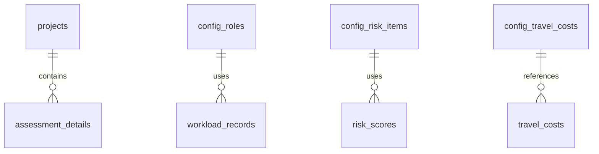
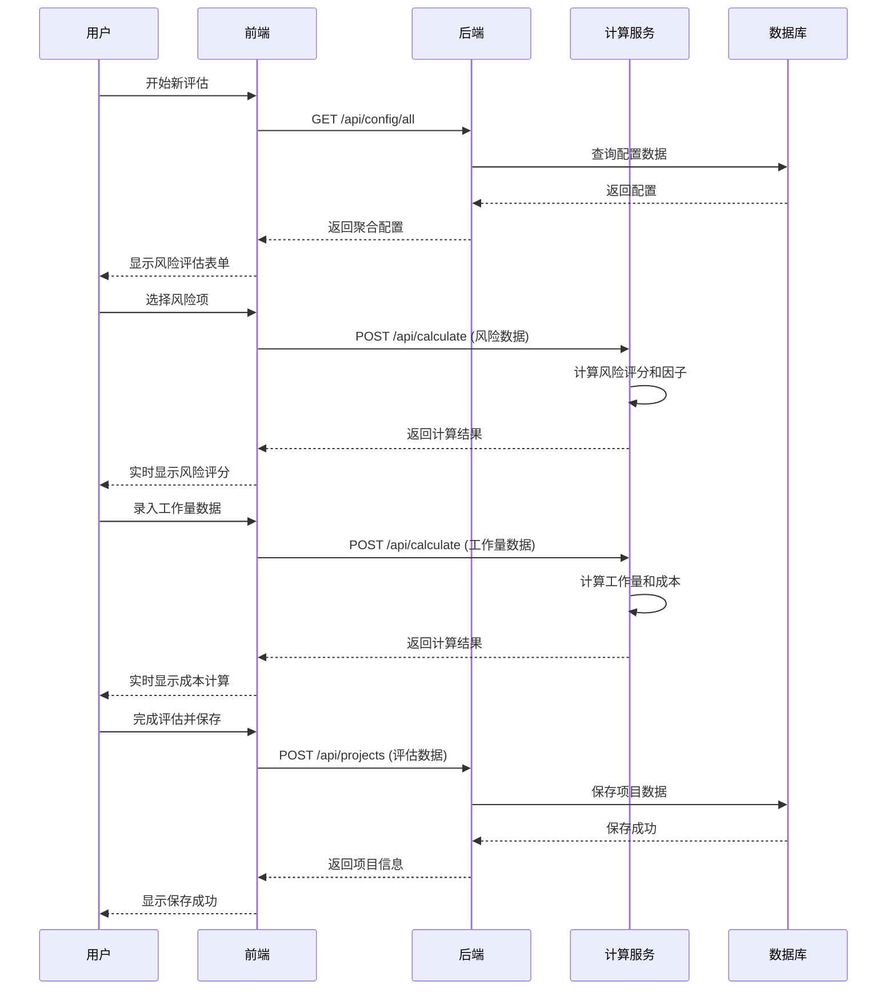
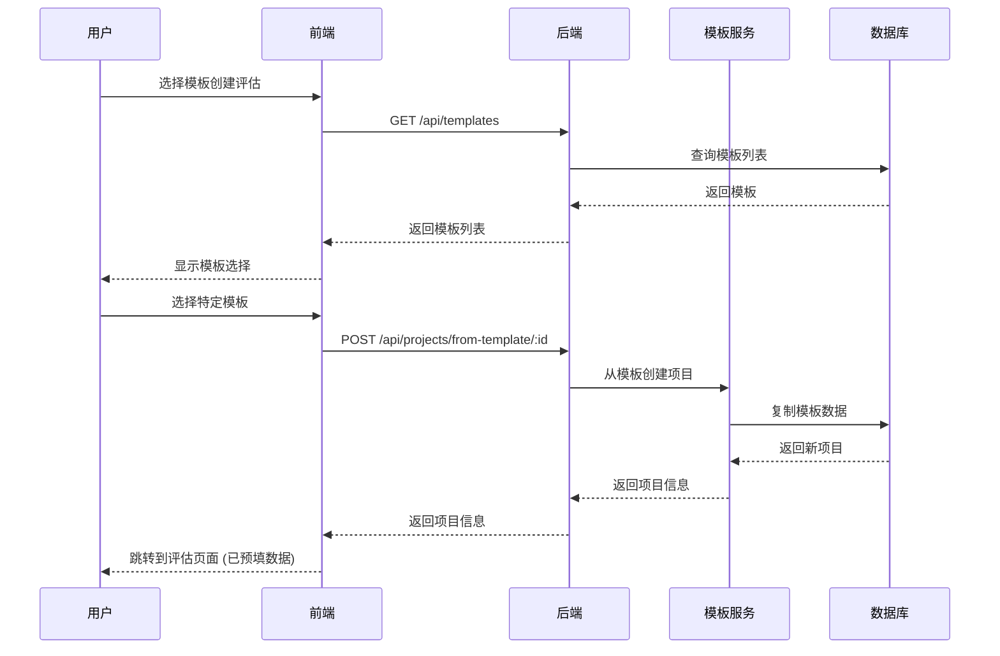

# 软件项目评估系统 (PPA) - 技术规范文档

**作者:** John (PM) + 开发团队  
**版本:** v2.0  
**最后更新:** 2025-11-08  
**项目级别:** Level 2-3  
**开发背景:** Brownfield (已有基础实现)

---

## 1. 文档变更记录

| 版本 | 日期 | 变更内容 | 作者 |
|------|------|----------|------|
| v2.0 | 2025-11-08 | 全面重构，覆盖所有PRD FR需求 | John (PM) |
| v1.0 | 2025-10-27 | 初始版本，主要关注仪表板功能 | bruce |

---

## 2. 总体架构设计

### 2.1 架构概览

```
┌─────────────────────────────────────┐
│         前端 (React + Ant Design)    │
│              端口: 8000              │
├─────────────────────────────────────┤
│         后端 (Node.js + Express)     │
│              端口: 3001              │
├─────────────────────────────────────┤
│         数据库 (SQLite3)             │
│            ppa.db                   │
└─────────────────────────────────────┘
```

### 2.2 技术栈选择

**前端技术栈**:
- **框架**: React 18+ (组件化开发)
- **UI库**: Ant Design Pro 5+ + Ant Design 5+
- **状态管理**: React Context + useState/useReducer
- **图表库**: @ant-design/charts
- **构建工具**: Vite/Webpack
- **类型系统**: TypeScript
- **包管理**: Yarn

**后端技术栈**:
- **运行时**: Node.js 16+
- **框架**: Express.js 4+
- **数据库**: SQLite3 (通过 sqlite3 npm包)
- **输入验证**: express-validator
- **文件生成**: PDFKit (PDF), ExcelJS (Excel)
- **日志**: Winston
- **测试**: Jest + Supertest

**部署与运维**:
- **容器化**: Docker (可选)
- **版本控制**: Git
- **数据备份**: SQLite备份机制

---

## 3. 数据库设计

### 3.1 数据库表结构

#### 3.1.1 projects (项目表)
```sql
CREATE TABLE projects (
    id INTEGER PRIMARY KEY AUTOINCREMENT,
    name TEXT NOT NULL,
    description TEXT,
    is_template BOOLEAN NOT NULL DEFAULT 0,
    final_total_cost REAL,          -- 最终总成本（万元）
    final_risk_score INTEGER,       -- 风险总分
    final_workload_days REAL,       -- 总工作量天数
    assessment_details_json TEXT,   -- 评估详情JSON
    created_at DATETIME DEFAULT CURRENT_TIMESTAMP,
    updated_at DATETIME DEFAULT CURRENT_TIMESTAMP
);
```

#### 3.1.2 config_roles (角色配置表)
```sql
CREATE TABLE config_roles (
    id INTEGER PRIMARY KEY AUTOINCREMENT,
    role_name TEXT NOT NULL UNIQUE,
    unit_price REAL NOT NULL,       -- 单价（元/人/天）
    is_active BOOLEAN DEFAULT 1
);
```

#### 3.1.3 config_risk_items (风险配置表)
```sql
CREATE TABLE config_risk_items (
    id INTEGER PRIMARY KEY AUTOINCREMENT,
    category TEXT NOT NULL,
    item_name TEXT NOT NULL,
    options_json TEXT NOT NULL,     -- 风险选项JSON
    is_active BOOLEAN DEFAULT 1
);
```

#### 3.1.4 config_travel_costs (差旅配置表)
```sql
CREATE TABLE config_travel_costs (
    id INTEGER PRIMARY KEY AUTOINCREMENT,
    item_name TEXT NOT NULL,
    cost_per_month REAL,            -- 月度成本
    is_active BOOLEAN DEFAULT 1
);
```

### 3.2 数据关系设计



---

## 4. API架构设计

### 4.1 路由结构

```
/api/
├── /health              # 系统健康检查
├── /config/             # 配置管理
│   ├── /roles          # 角色配置 (FR-010)
│   ├── /risk-items     # 风险配置 (FR-011)
│   ├── /travel-costs   # 差旅配置 (FR-012)
│   └── /all            # 聚合配置 (FR-010.2, FR-011.2, FR-012.2)
├── /projects/          # 项目管理 (FR-001)
│   ├── /               # 项目列表 (FR-021)
│   ├── /:id            # 项目详情 (FR-022)
│   ├── /:id/export     # 报告导出 (FR-005)
│   └── /templates      # 模板管理 (FR-004)
├── /calculate/         # 实时计算 (FR-002, FR-030, FR-031)
└── /dashboard/         # 数据看板 (FR-020)
```

### 4.2 核心API端点详细设计

#### 4.2.1 项目管理API (FR-001, FR-021, FR-022)

**GET /api/projects**
- **功能**: 获取项目列表 (FR-021)
- **查询参数**: `?template=false&search=name&sort=created_at&page=1&limit=10`
- **返回**: 项目列表分页数据
- **FR覆盖**: FR-021 (历史项目列表)

**POST /api/projects**
- **功能**: 创建新项目 (FR-001.1, FR-001.2)
- **请求体**: 项目基本信息 + 评估详情JSON
- **返回**: 创建的项目详情
- **FR覆盖**: FR-001.1, FR-001.2

**GET /api/projects/:id**
- **功能**: 获取项目详情 (FR-022)
- **返回**: 完整项目信息和评估详情
- **FR覆盖**: FR-022

**PUT /api/projects/:id**
- **功能**: 更新项目信息 (FR-001.4)
- **返回**: 更新后的项目信息
- **FR覆盖**: FR-001.4

**DELETE /api/projects/:id**
- **功能**: 删除项目 (FR-001.4)
- **返回**: 删除成功确认
- **FR覆盖**: FR-001.4

#### 4.2.2 配置管理API (FR-010, FR-011, FR-012)

**GET /api/config/roles**
- **功能**: 获取角色配置列表 (FR-010)
- **返回**: 所有激活的角色配置
- **FR覆盖**: FR-010

**POST /api/config/roles**
- **功能**: 创建新角色配置 (FR-010)
- **返回**: 创建的角色配置
- **FR覆盖**: FR-010

**PUT /api/config/roles/:id**
- **功能**: 更新角色配置 (FR-010)
- **返回**: 更新后的配置
- **FR覆盖**: FR-010

**DELETE /api/config/roles/:id**
- **功能**: 删除角色配置 (FR-010)
- **返回**: 删除成功确认
- **FR覆盖**: FR-010

**GET /api/config/risk-items**
- **功能**: 获取风险评估项目配置 (FR-011)
- **返回**: 风险项目配置列表
- **FR覆盖**: FR-011

**GET /api/config/travel-costs**
- **功能**: 获取差旅成本配置 (FR-012)
- **返回**: 差旅成本配置列表
- **FR覆盖**: FR-012

**GET /api/config/all**
- **功能**: 聚合获取所有配置 (FR-010.2, FR-011.2, FR-012.2)
- **返回**: 包含所有配置的JSON对象
- **FR覆盖**: FR-010.2, FR-011.2, FR-012.2

#### 4.2.3 实时计算API (FR-002, FR-030, FR-031)

**POST /api/calculate**
- **功能**: 实时成本计算 (FR-002, FR-030, FR-031)
- **请求体**: 评估数据（风险评分、工作量、成本等）
- **返回**: 计算结果（总成本、工时、风险因子等）
- **计算逻辑**:
  ```javascript
  {
    // 基础计算
    software_dev_cost: calculateDevCost(workloads),
    system_integration_cost: calculateIntegrationCost(workloads),
    travel_cost: calculateTravelCost(travelData),
    maintenance_cost: calculateMaintenanceCost(maintenanceData),
    risk_cost: calculateRiskCost(riskData),
    
    // 汇总计算
    total_cost: sum(allCosts),
    total_workload_days: sum(allWorkloads),
    
    // 风险计算
    risk_score: calculateRiskScore(riskSelections),
    rating_factor: calculateRatingFactor(riskScore),
    rating_ratio: riskScore / 100,
    risk_max_score: getMaxRiskScore()
  }
  ```
- **FR覆盖**: FR-002, FR-030, FR-031

#### 4.2.4 模板管理API (FR-004, FR-032)

**GET /api/templates**
- **功能**: 获取模板列表 (FR-004.2)
- **返回**: 所有模板项目列表
- **FR覆盖**: FR-004.2

**POST /api/projects/:id/save-as-template**
- **功能**: 将项目保存为模板 (FR-004.1)
- **返回**: 生成的模板信息
- **FR覆盖**: FR-004.1

**POST /api/projects/from-template/:templateId**
- **功能**: 从模板创建新项目 (FR-004.3, FR-032)
- **返回**: 基于模板创建的新项目
- **FR覆盖**: FR-004.3, FR-032

#### 4.2.5 报告导出API (FR-005)

**POST /api/projects/:id/export/pdf**
- **功能**: 导出PDF报告 (FR-005)
- **返回**: PDF文件流
- **实现**: 使用PDFKit生成专业格式报告

**POST /api/projects/:id/export/excel**
- **功能**: 导出Excel报告 (FR-005)
- **返回**: Excel文件流
- **实现**: 使用ExcelJS生成详细数据表

#### 4.2.6 数据看板API (FR-020)

**GET /api/dashboard/summary**
- **功能**: 获取Dashboard概览数据 (FR-020)
- **返回**: 项目统计概览
- **数据包括**: 项目总数、总成本、平均成本、风险分布

**GET /api/dashboard/cost-breakdown**
- **功能**: 成本构成分布数据 (FR-020)
- **返回**: 成本构成百分比数据

**GET /api/dashboard/risk-distribution**
- **功能**: 风险等级分布数据 (FR-020)
- **返回**: 风险等级统计

---

## 5. 前端架构设计

### 5.1 项目结构

```
frontend/ppa_frontend/src/
├── components/          # 公共组件
│   ├── Layout/         # 布局组件
│   ├── Forms/          # 表单组件
│   ├── Charts/         # 图表组件
│   └── Common/         # 通用组件
├── pages/              # 页面组件
│   ├── Dashboard/      # 数据看板 (FR-020)
│   ├── Assessment/     # 评估向导 (FR-003)
│   │   ├── New/        # 新建评估
│   │   ├── History/    # 历史项目 (FR-021)
│   │   └── Detail/     # 项目详情 (FR-022)
│   ├── Config/         # 参数配置 (FR-010, FR-011, FR-012)
│   └── Templates/      # 模板管理 (FR-004)
├── services/           # API服务
│   ├── api/           # API调用
│   ├── config/        # 配置服务
│   └── calculate/     # 计算服务
├── utils/             # 工具函数
├── hooks/             # 自定义Hooks
└── types/             # TypeScript类型定义
```

### 5.2 核心页面设计

#### 5.2.1 评估向导页面 (FR-003)
```
/assessment/new
├── 步骤1: 风险评估 (FR-030)
│   ├── 风险项选择表单
│   ├── 实时风险评分显示
│   └── 评分因子计算展示
├── 步骤2: 工作量估算 (FR-031)
│   ├── 新功能开发工作量表格
│   ├── 系统对接工作量表格
│   └── 实时工时成本计算
├── 步骤3: 其他成本录入 (FR-031.2)
│   ├── 差旅成本录入
│   ├── 运维成本录入
│   └── 风险成本录入
└── 步骤4: 评估总览和保存 (FR-004)
    ├── 成本构成图表展示
    ├── 评估详情确认
    └── 项目保存/模板保存
```

#### 5.2.2 历史项目列表页面 (FR-021)
```
/assessment/history
├── 项目搜索和筛选
├── 项目列表表格
│   ├── 项目名称
│   ├── 最终成本
│   ├── 风险分数
│   ├── 创建时间
│   └── 操作按钮 (查看/编辑/删除)
├── 分页控制
└── 批量操作 (可选)
```

#### 5.2.3 项目详情页面 (FR-022, FR-005)
```
/assessment/detail/:id
├── 项目概览信息
├── 评估详情展示
│   ├── 风险评分详情
│   ├── 工作量构成
│   ├── 成本明细
│   └── 成本构成图表
└── 操作区域
    ├── 导出PDF按钮
    ├── 导出Excel按钮
    └── 编辑按钮
```

### 5.3 状态管理设计

#### 5.3.1 React Context状态
```typescript
// AppContext.tsx
interface AppState {
  // 配置数据
  config: {
    roles: RoleConfig[];
    riskItems: RiskItemConfig[];
    travelCosts: TravelCostConfig[];
  };
  
  // 当前评估数据
  currentAssessment: {
    riskScores: RiskScore[];
    workloads: Workload[];
    otherCosts: OtherCost[];
    calculatedResults: CalculationResult;
  };
  
  // UI状态
  ui: {
    loading: boolean;
    error: string | null;
    currentStep: number;
  };
}
```

#### 5.3.2 自定义Hooks
```typescript
// hooks/useAssessment.ts
export const useAssessment = () => {
  const [assessment, setAssessment] = useState<AssessmentData>();
  const [calculating, setCalculating] = useState(false);
  
  const calculate = useCallback(async (data: AssessmentData) => {
    setCalculating(true);
    try {
      const result = await calculationAPI.calculate(data);
      setAssessment({ ...data, result });
      return result;
    } finally {
      setCalculating(false);
    }
  }, []);
  
  return { assessment, calculate, calculating };
};
```

---

## 6. 后端架构设计

### 6.1 服务层架构

```
server/
├── controllers/        # 控制器层
│   ├── projectController.js    # 项目管理 (FR-001)
│   ├── configController.js     # 配置管理 (FR-010,011,012)
│   ├── calculationController.js # 计算服务 (FR-002,030,031)
│   ├── templateController.js   # 模板管理 (FR-004,032)
│   ├── exportController.js     # 导出服务 (FR-005)
│   └── dashboardController.js  # 数据看板 (FR-020)
├── services/          # 业务逻辑层
│   ├── projectService.js       # 项目业务逻辑
│   ├── configService.js        # 配置业务逻辑
│   ├── calculationService.js   # 核心计算逻辑
│   ├── templateService.js      # 模板业务逻辑
│   ├── exportService.js        # 导出业务逻辑
│   └── dashboardService.js     # 看板数据聚合
├── models/            # 数据模型层
│   ├── Project.js
│   ├── Config.js
│   └── ...
├── routes/            # 路由层
│   ├── index.js       # 路由聚合
│   ├── projects.js
│   ├── config.js
│   ├── calculation.js
│   └── ...
├── utils/             # 工具层
│   ├── db.js          # 数据库连接
│   ├── validation.js  # 数据验证
│   ├── calculation.js # 计算工具
│   └── logger.js      # 日志工具
└── middleware/        # 中间件
    ├── auth.js        # 认证中间件 (未来扩展)
    ├── validation.js  # 输入验证
    ├── errorHandler.js # 错误处理
    └── logger.js      # 请求日志
```

### 6.2 核心业务逻辑设计

#### 6.2.1 计算服务 (FR-002, FR-030, FR-031)
```javascript
// services/calculationService.js
class CalculationService {
  
  // 风险评分计算 (FR-030)
  calculateRiskScore(riskSelections) {
    let totalScore = 0;
    let maxScore = 0;
    
    riskSelections.forEach(selection => {
      const option = selection.selectedOption;
      totalScore += option.score;
      maxScore += option.maxScore;
    });
    
    return {
      riskScore: totalScore,
      maxScore: maxScore,
      ratio: totalScore / maxScore,
      riskLevel: this.getRiskLevel(totalScore)
    };
  }
  
  // 评分因子计算 (FR-030)
  calculateRatingFactor(riskScore, maxScore) {
    const ratio = riskScore / maxScore;
    
    if (ratio <= 0.8) return 1.0;
    if (ratio <= 1.0) return 1.0 + (ratio - 0.8) * 1.0; // 1.0 to 1.2
    if (ratio <= 1.2) return 1.2 + (ratio - 1.0) * 1.5; // 1.2 to 1.5
    return 1.5; // Cap at 1.5
  }
  
  // 工作量和成本计算 (FR-031)
  calculateWorkloadAndCost(workloads, roles, ratingFactor) {
    let softwareDevCost = 0;
    let systemIntegrationCost = 0;
    let totalWorkloadDays = 0;
    
    workloads.forEach(workload => {
      const role = roles.find(r => r.id === workload.roleId);
      if (!role) return;
      
      const cost = workload.days * role.unit_price * ratingFactor;
      
      if (workload.type === 'development') {
        softwareDevCost += cost;
      } else if (workload.type === 'integration') {
        systemIntegrationCost += cost;
      }
      
      totalWorkloadDays += workload.days;
    });
    
    return {
      softwareDevCost,
      systemIntegrationCost,
      totalWorkloadDays
    };
  }
  
  // 综合计算 (FR-002)
  async calculateComprehensive(assessmentData) {
    // 风险评分
    const riskResult = this.calculateRiskScore(assessmentData.riskSelections);
    const ratingFactor = this.calculateRatingFactor(
      riskResult.riskScore, 
      riskResult.maxScore
    );
    
    // 工作量和成本
    const workloadResult = this.calculateWorkloadAndCost(
      assessmentData.workloads,
      assessmentData.roles,
      ratingFactor
    );
    
    // 其他成本
    const otherCosts = this.calculateOtherCosts(assessmentData.otherCosts);
    
    // 总计算
    const totalCost = workloadResult.softwareDevCost + 
                     workloadResult.systemIntegrationCost + 
                     otherCosts.travelCost + 
                     otherCosts.maintenanceCost + 
                     otherCosts.riskCost;
    
    return {
      // 基础成本
      software_dev_cost: workloadResult.softwareDevCost,
      system_integration_cost: workloadResult.systemIntegrationCost,
      travel_cost: otherCosts.travelCost,
      maintenance_cost: otherCosts.maintenanceCost,
      risk_cost: otherCosts.riskCost,
      
      // 汇总
      total_cost: totalCost,
      total_workload_days: workloadResult.totalWorkloadDays,
      
      // 风险相关
      risk_score: riskResult.riskScore,
      risk_max_score: riskResult.maxScore,
      rating_factor: ratingFactor,
      rating_ratio: riskResult.ratio,
      risk_level: riskResult.riskLevel
    };
  }
}
```

#### 6.2.2 模板服务 (FR-004, FR-032)
```javascript
// services/templateService.js
class TemplateService {
  
  // 保存为模板 (FR-004.1)
  async saveAsTemplate(projectId, templateData) {
    const project = await this.getProjectById(projectId);
    
    const template = {
      name: templateData.name,
      description: templateData.description,
      is_template: true,
      assessment_details_json: project.assessment_details_json,
      final_total_cost: project.final_total_cost,
      final_risk_score: project.final_risk_score,
      final_workload_days: project.final_workload_days
    };
    
    return await this.createTemplate(template);
  }
  
  // 从模板创建项目 (FR-004.3, FR-032)
  async createFromTemplate(templateId, projectData) {
    const template = await this.getTemplateById(templateId);
    
    // 复制模板的评估数据，但重置项目特定字段
    const newProjectData = {
      ...projectData,
      assessment_details_json: template.assessment_details_json,
      is_template: false,
      final_total_cost: null,
      final_risk_score: null,
      final_workload_days: null
    };
    
    return await this.createProject(newProjectData);
  }
  
  // 获取模板列表 (FR-004.2)
  async getTemplateList(filters = {}) {
    const whereClause = {
      is_template: true,
      ...filters
    };
    
    return await this.findProjects(whereClause);
  }
}
```

#### 6.2.3 导出服务 (FR-005)
```javascript
// services/exportService.js
class ExportService {
  
  // PDF导出 (FR-005)
  async exportToPDF(projectId) {
    const project = await this.getProjectById(projectId);
    const assessmentData = JSON.parse(project.assessment_details_json);
    
    const doc = new PDFDocument();
    
    // 设置文档属性
    doc.info.Title = `PPA项目评估报告 - ${project.name}`;
    doc.info.Author = 'PPA系统';
    
    // 添加标题
    doc.fontSize(20).text('项目评估报告', { align: 'center' });
    doc.moveDown();
    
    // 项目基本信息
    doc.fontSize(16).text('项目信息', { underline: true });
    doc.fontSize(12);
    doc.text(`项目名称: ${project.name}`);
    doc.text(`描述: ${project.description || '无'}`);
    doc.text(`创建时间: ${project.created_at}`);
    doc.moveDown();
    
    // 评估结果
    doc.fontSize(16).text('评估结果', { underline: true });
    doc.fontSize(12);
    doc.text(`风险评分: ${project.final_risk_score}`);
    doc.text(`总工作量: ${project.final_workload_days}天`);
    doc.text(`总成本: ${project.final_total_cost}万元`);
    doc.moveDown();
    
    // 详细成本构成
    if (assessmentData.costBreakdown) {
      doc.fontSize(16).text('成本构成', { underline: true });
      doc.fontSize(12);
      const breakdown = assessmentData.costBreakdown;
      doc.text(`软件开发成本: ${breakdown.softwareDevCost}万元`);
      doc.text(`系统集成成本: ${breakdown.systemIntegrationCost}万元`);
      doc.text(`差旅成本: ${breakdown.travelCost}万元`);
      doc.text(`运维成本: ${breakdown.maintenanceCost}万元`);
      doc.text(`风险成本: ${breakdown.riskCost}万元`);
    }
    
    doc.end();
    return doc;
  }
  
  // Excel导出 (FR-005)
  async exportToExcel(projectId) {
    const project = await this.getProjectById(projectId);
    const assessmentData = JSON.parse(project.assessment_details_json);
    
    const workbook = new ExcelJS.Workbook();
    const worksheet = workbook.addWorksheet('项目评估报告');
    
    // 设置列宽
    worksheet.columns = [
      { header: '项目', key: 'item', width: 20 },
      { header: '值', key: 'value', width: 30 },
      { header: '备注', key: 'note', width: 20 }
    ];
    
    // 项目基本信息
    worksheet.addRow(['项目名称', project.name, '']);
    worksheet.addRow(['描述', project.description || '无', '']);
    worksheet.addRow(['创建时间', project.created_at, '']);
    worksheet.addRow(['', '', '']);
    
    // 评估结果
    worksheet.addRow(['评估结果', '', '']);
    worksheet.addRow(['风险评分', project.final_risk_score, '']);
    worksheet.addRow(['总工作量', `${project.final_workload_days}天`, '']);
    worksheet.addRow(['总成本', `${project.final_total_cost}万元`, '']);
    worksheet.addRow(['', '', '']);
    
    // 详细成本构成
    if (assessmentData.costBreakdown) {
      const breakdown = assessmentData.costBreakdown;
      worksheet.addRow(['成本构成', '', '']);
      worksheet.addRow(['软件开发成本', `${breakdown.softwareDevCost}万元`, '']);
      worksheet.addRow(['系统集成成本', `${breakdown.systemIntegrationCost}万元`, '']);
      worksheet.addRow(['差旅成本', `${breakdown.travelCost}万元`, '']);
      worksheet.addRow(['运维成本', `${breakdown.maintenanceCost}万元`, '']);
      worksheet.addRow(['风险成本', `${breakdown.riskCost}万元`, '']);
    }
    
    return workbook;
  }
}
```

---

## 7. 数据流设计

### 7.1 评估流程数据流



### 7.2 模板应用数据流



---

## 8. 性能优化策略

### 8.1 前端性能优化

1. **代码分割**
   ```javascript
   // 使用React.lazy进行路由级代码分割
   const Assessment = React.lazy(() => import('./pages/Assessment'));
   const Dashboard = React.lazy(() => import('./pages/Dashboard'));
   ```

2. **数据缓存**
   ```typescript
   // 配置数据缓存
   const useConfigCache = () => {
     const [config, setConfig] = useState(null);
     
     useEffect(() => {
       if (!config) {
         // 尝试从localStorage获取缓存
         const cached = localStorage.getItem('ppa_config');
         if (cached) {
           setConfig(JSON.parse(cached));
         } else {
           // 从API获取并缓存
           fetchConfig().then(data => {
             setConfig(data);
             localStorage.setItem('ppa_config', JSON.stringify(data));
           });
         }
       }
     }, [config]);
     
     return config;
   };
   ```

3. **虚拟滚动** (大数据列表)
   ```typescript
   // 大数据量项目列表使用虚拟滚动
   import { FixedSizeList as List } from 'react-window';
   
   const ProjectList = ({ projects }) => (
     <List
       height={600}
       itemCount={projects.length}
       itemSize={50}
       itemData={projects}
     >
       {({ index, style, data }) => (
         <div style={style}>
           {data[index].name}
         </div>
       )}
     </List>
   );
   ```

### 8.2 后端性能优化

1. **数据库查询优化**
   ```javascript
   // 使用索引优化查询
   CREATE INDEX idx_projects_created_at ON projects(created_at);
   CREATE INDEX idx_projects_is_template ON projects(is_template);
   CREATE INDEX idx_config_roles_active ON config_roles(is_active);
   
   // 使用预编译语句
   const getProjects = db.prepare(`
     SELECT * FROM projects 
     WHERE is_template = ? 
     ORDER BY created_at DESC 
     LIMIT ? OFFSET ?
   `);
   ```

2. **缓存策略**
   ```javascript
   // 简单内存缓存
   const cache = new Map();
   
   const getCachedConfig = (key, fetcher, ttl = 300000) => {
     const cached = cache.get(key);
     if (cached && Date.now() - cached.timestamp < ttl) {
       return cached.data;
     }
     
     const data = fetcher();
     cache.set(key, {
       data,
       timestamp: Date.now()
     });
     
     return data;
   };
   ```

3. **API响应优化**
   ```javascript
   // 响应压缩
   const compression = require('compression');
   app.use(compression());
   
   // 设置缓存头
   const setCacheHeaders = (req, res, next) => {
     res.set('Cache-Control', 'public, max-age=300');
     next();
   };
   ```

---

## 9. 安全性设计

### 9.1 输入验证

```javascript
// 使用express-validator进行输入验证
const { body, validationResult } = require('express-validator');

const projectValidation = [
  body('name')
    .isLength({ min: 1, max: 100 })
    .withMessage('项目名称不能为空且长度不超过100字符'),
  body('description')
    .optional()
    .isLength({ max: 500 })
    .withMessage('描述长度不能超过500字符'),
  body('final_total_cost')
    .optional()
    .isFloat({ min: 0 })
    .withMessage('成本必须为非负数'),
  // ... 更多验证规则
];

const handleValidationErrors = (req, res, next) => {
  const errors = validationResult(req);
  if (!errors.isEmpty()) {
    return res.status(400).json({
      success: false,
      errors: errors.array()
    });
  }
  next();
};
```

### 9.2 SQL注入防护

```javascript
// 使用参数化查询
const getProject = async (id) => {
  return await db.get(
    'SELECT * FROM projects WHERE id = ?',
    [id]
  );
};

// 使用预编译语句
const insertProject = db.prepare(`
  INSERT INTO projects (name, description, final_total_cost)
  VALUES (?, ?, ?)
`);
```

### 9.3 错误处理

```javascript
// 全局错误处理中间件
const errorHandler = (err, req, res, next) => {
  console.error('Error:', err);
  
  // 不要泄露内部错误信息
  if (err.name === 'ValidationError') {
    return res.status(400).json({
      success: false,
      message: '输入数据验证失败',
      errors: err.details
    });
  }
  
  if (err.code === 'SQLITE_CONSTRAINT') {
    return res.status(400).json({
      success: false,
      message: '数据约束冲突，请检查输入数据'
    });
  }
  
  // 通用错误响应
  res.status(500).json({
    success: false,
    message: '服务器内部错误'
  });
};
```

---

## 10. 测试策略

### 10.1 单元测试

**后端测试**
```javascript
// tests/calculationService.test.js
describe('CalculationService', () => {
  test('should calculate risk score correctly', () => {
    const riskSelections = [
      { itemId: 1, selectedOption: { score: 5, maxScore: 10 } },
      { itemId: 2, selectedOption: { score: 3, maxScore: 10 } }
    ];
    
    const result = calculationService.calculateRiskScore(riskSelections);
    
    expect(result.riskScore).toBe(8);
    expect(result.maxScore).toBe(20);
    expect(result.ratio).toBe(0.4);
  });
  
  test('should calculate rating factor correctly', () => {
    const ratingFactor = calculationService.calculateRatingFactor(8, 20);
    expect(ratingFactor).toBe(1.0); // ratio = 0.4, should be 1.0
  });
});
```

**前端测试**
```javascript
// tests/AssessmentForm.test.jsx
import { render, screen, fireEvent } from '@testing-library/react';
import AssessmentForm from '../AssessmentForm';

describe('AssessmentForm', () => {
  test('should calculate risk score when risk item is selected', () => {
    render(<AssessmentForm />);
    
    const riskOption = screen.getByLabelText('低风险');
    fireEvent.click(riskOption);
    
    expect(screen.getByText('风险评分:')).toBeInTheDocument();
  });
});
```

### 10.2 集成测试

```javascript
// tests/api.test.js
const request = require('supertest');
const app = require('../server/index');

describe('Projects API', () => {
  test('POST /api/projects should create a project', async () => {
    const projectData = {
      name: '测试项目',
      description: '测试描述',
      assessment_details: {}
    };
    
    const response = await request(app)
      .post('/api/projects')
      .send(projectData)
      .expect(201);
    
    expect(response.body.success).toBe(true);
    expect(response.body.data.name).toBe('测试项目');
  });
});
```

### 10.3 端到端测试

```javascript
// cypress/integration/assessment.spec.js
describe('Assessment Flow', () => {
  it('should complete full assessment process', () => {
    cy.visit('/assessment/new');
    
    // 风险评估步骤
    cy.get('[data-testid="risk-option-low"]').click();
    cy.get('[data-testid="next-step"]').click();
    
    // 工作量估算步骤
    cy.get('[data-testid="add-workload"]').click();
    cy.get('[data-testid="role-select"]').select('开发');
    cy.get('[data-testid="days-input"]').type('10');
    cy.get('[data-testid="next-step"]').click();
    
    // 其他成本步骤
    cy.get('[data-testid="travel-cost"]').type('5000');
    cy.get('[data-testid="next-step"]').click();
    
    // 保存项目
    cy.get('[data-testid="project-name"]').type('测试项目');
    cy.get('[data-testid="save-project"]').click();
    
    cy.url().should('include', '/assessment/history');
  });
});
```

---

## 11. 部署策略

### 11.1 Docker化部署

**Dockerfile (后端)**
```dockerfile
FROM node:16-alpine

WORKDIR /app

COPY package*.json ./
RUN npm ci --only=production

COPY . .

EXPOSE 3001

CMD ["node", "index.js"]
```

**Dockerfile (前端)**
```dockerfile
FROM node:16-alpine as builder

WORKDIR /app
COPY package*.json ./
RUN npm ci

COPY . .
RUN npm run build

FROM nginx:alpine
COPY --from=builder /app/dist /usr/share/nginx/html
COPY nginx.conf /etc/nginx/nginx.conf

EXPOSE 80
CMD ["nginx", "-g", "daemon off;"]
```

### 11.2 部署脚本

```bash
#!/bin/bash
# deploy.sh

echo "开始部署PPA系统..."

# 构建前端
cd frontend/ppa_frontend
npm run build
cd ../..

# 构建后端
cd server
npm ci --only=production
cd ..

# 停止现有服务
docker-compose down

# 启动新服务
docker-compose up -d

echo "部署完成！"
```

---

## 12. 监控与日志

### 12.1 应用监控

```javascript
// utils/monitor.js
const winston = require('winston');

const logger = winston.createLogger({
  level: 'info',
  format: winston.format.combine(
    winston.format.timestamp(),
    winston.format.json()
  ),
  transports: [
    new winston.transports.File({ filename: 'error.log', level: 'error' }),
    new winston.transports.File({ filename: 'combined.log' })
  ]
});

// 性能监控中间件
const performanceMonitor = (req, res, next) => {
  const start = Date.now();
  
  res.on('finish', () => {
    const duration = Date.now() - start;
    logger.info('Request completed', {
      method: req.method,
      url: req.url,
      statusCode: res.statusCode,
      duration: `${duration}ms`
    });
    
    // 性能告警
    if (duration > 5000) {
      logger.warn('Slow request detected', {
        url: req.url,
        duration: `${duration}ms`
      });
    }
  });
  
  next();
};
```

### 12.2 健康检查

```javascript
// routes/health.js
router.get('/health', async (req, res) => {
  const healthCheck = {
    uptime: process.uptime(),
    message: 'OK',
    timestamp: Date.now(),
    services: {
      database: 'unknown'
    }
  };
  
  try {
    // 检查数据库连接
    await db.get('SELECT 1');
    healthCheck.services.database = 'OK';
  } catch (error) {
    healthCheck.services.database = 'ERROR';
    healthCheck.message = 'Database connection failed';
  }
  
  const statusCode = healthCheck.services.database === 'OK' ? 200 : 503;
  res.status(statusCode).json(healthCheck);
});
```

---

## 13. 扩展性设计

### 13.1 模块化架构

每个功能模块都应该是独立的，便于扩展：

```javascript
// 插件系统设计
class PluginManager {
  plugins = new Map();
  
  registerPlugin(name, plugin) {
    this.plugins.set(name, plugin);
  }
  
  async executeHook(hookName, data) {
    const results = [];
    for (const [name, plugin] of this.plugins) {
      if (plugin.hooks && plugin.hooks[hookName]) {
        try {
          const result = await plugin.hooks[hookName](data);
          results.push({ plugin: name, result });
        } catch (error) {
          console.error(`Plugin ${name} hook ${hookName} failed:`, error);
        }
      }
    }
    return results;
  }
}

// 风险计算插件示例
const riskCalculationPlugin = {
  name: 'risk-calculation',
  hooks: {
    beforeCalculate: (assessmentData) => {
      // 添加自定义风险计算逻辑
      return assessmentData;
    },
    afterCalculate: (result) => {
      // 添加自定义风险分析
      return result;
    }
  }
};
```

### 13.2 配置驱动

```javascript
// 配置文件支持不同环境
// config/development.js
module.exports = {
  database: 'ppa.db',
  port: 3001,
  logLevel: 'debug'
};

// config/production.js
module.exports = {
  database: process.env.DATABASE_URL || 'ppa.db',
  port: process.env.PORT || 3001,
  logLevel: 'info'
};
```

---

## 14. 文档和API

### 14.1 API文档自动生成

```javascript
// 使用swagger自动生成API文档
const swaggerJSDoc = require('swagger-jsdoc');

const options = {
  definition: {
    openapi: '3.0.0',
    info: {
      title: 'PPA API',
      version: '2.0.0',
      description: 'Project Portfolio Assessment System API'
    }
  },
  apis: ['./routes/*.js']
};

const swaggerSpec = swaggerJSDoc(options);
```

### 14.2 代码文档

```javascript
/**
 * 计算项目评估的综合成本和工时
 * @param {Object} assessmentData - 评估数据对象
 * @param {Array} assessmentData.riskSelections - 风险选择数组
 * @param {Array} assessmentData.workloads - 工作量数据数组
 * @param {Array} assessmentData.roles - 角色配置数组
 * @param {Object} assessmentData.otherCosts - 其他成本对象
 * @returns {Promise<Object>} 计算结果对象
 * 
 * @example
 * const result = await calculationService.calculateComprehensive({
 *   riskSelections: [{itemId: 1, selectedOption: {score: 5}}],
 *   workloads: [{roleId: 1, days: 10, type: 'development'}],
 *   roles: [{id: 1, unit_price: 800}],
 *   otherCosts: {travel: 5000, maintenance: 3000}
 * });
 * 
 * @throws {ValidationError} 当输入数据验证失败时抛出
 * @throws {CalculationError} 当计算过程中发生错误时抛出
 */
async calculateComprehensive(assessmentData) {
  // 实现逻辑
}
```

---

## 15. 未来扩展考虑

### 15.1 微服务化
- 将计算服务独立为微服务
- 使用消息队列处理异步计算
- 支持水平扩展

### 15.2 云原生
- Kubernetes部署
- 服务网格
- 自动扩缩容

### 15.3 AI集成
- 机器学习模型集成
- 智能风险预测
- 自动化成本估算

### 15.4 多租户支持
- 数据隔离
- 权限管理
- 定制化配置

---

**文档结束**

---

**本技术规范文档全面覆盖了PRD中的32个功能需求(FR)，提供了完整的技术架构设计、实施方案和最佳实践指导。所有技术决策都经过仔细考虑，确保系统的可扩展性、可维护性和高性能。**